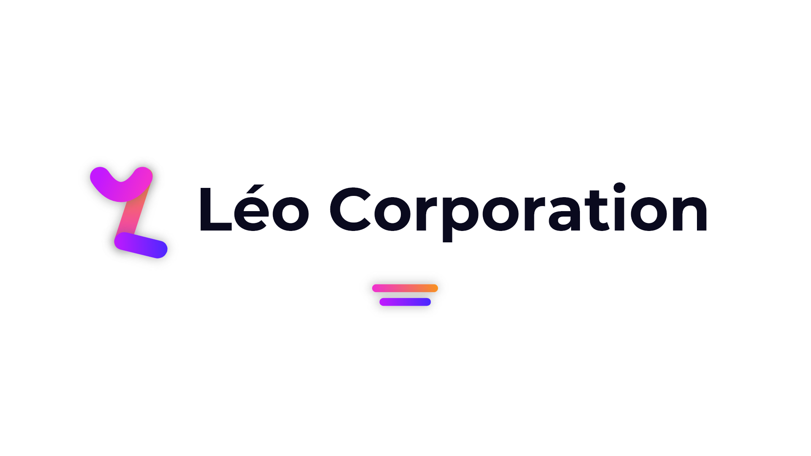

2021 is going to be a big year for Léo Corporation. And one of the big announcement this year is our new graphic identity. You may notice, but we've got a new logo and a new [website](https://leocorporation.dev/).

It is a part of our new direction for this year. The new logo is more coloful than the older one, and has a new font that we are starting to roll out to our customers: Montserrat.

But this is not only this. We've also updated some icons of our softwares:

These new logos are going to roll out progressively to our users.