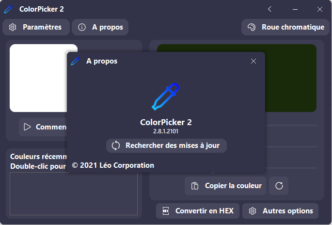

A new version of ColorPicker 2 is now available and it's the version 1.8.1.2101.

## Changelog
### New
- Added a copyright mention in the "About" window
### Fixed
- Fixed an issue where ColorPicker 2 crashed when trying to select a color
### Updated
- Updated ColorPicker 2 dependencies (LeoCorpLibrary)

## Download
[Click here](https://tinyurl.com/DownloadColorPicker) to download ColorPicker 2.

## Screenshot
