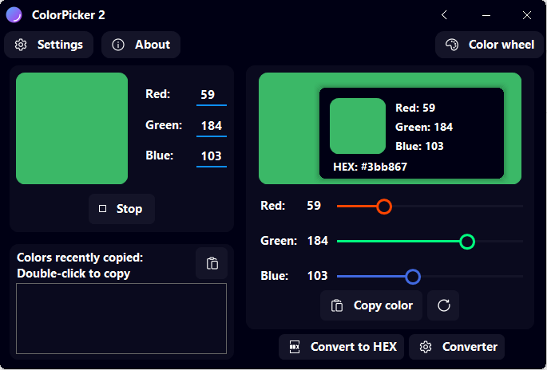

A new version of ColorPicker 2 is available and it is the version 2.10.1.2104. Note that this version is a minor one, with only bug fixes.

## Changelog
### Fixed
- Fixed an issue with “Mini picker” where the “#” was on the “Blue” value instead of the “HEX” value
### Updated
- Updated the icon of ColorPicker’s notifications
- Updated Copyright

## Download

[Click here](https://tinyurl.com/DownloadColorPicker) to download ColorPicker 2.

## Screenshot

