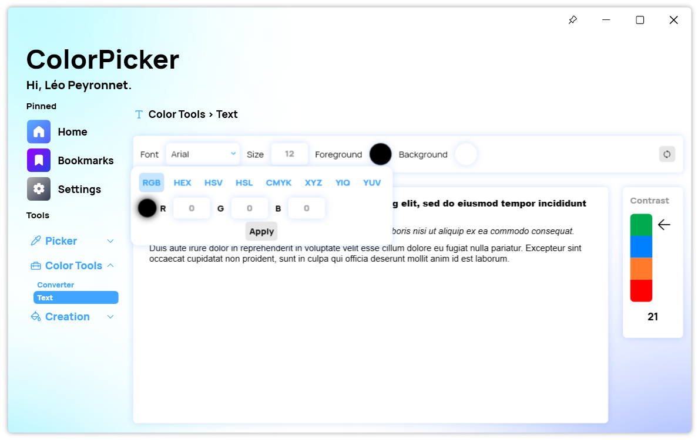

A new version of ColorPicker Max is now available, and it is the version 5.1.0.2304.

## Changelog
### New
- Added the possibility to generate random colors in Text Tool (#256)
- Added the possibility to enter custom text in Text Tool (#257)
- Added translations (#258)
- Added the possibility to generate XAML code for gradients (#258)
- Added new color selector for Text Tool (#259)
- Added new color selector for Gradient page (#259)
- Added the possibility to generate random color (#259)

### Updated
- Updated PeyrSharp.Env
- Updated PeyrSharp.Core
- Updated ColorHelper

## Download

[Click here](https://tinyurl.com/DownloadColorPickerMax) to download ColorPicker Max.

[Learn More](https://leocorporation.dev/store/colorpickermax) about ColorPicker Max.

## Screenshot

