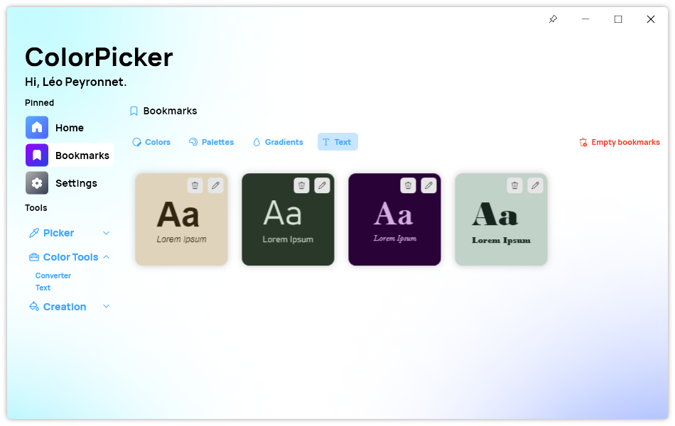

A new version of ColorPicker Max is now available, and it is the version 5.2.0.2305.

## Changelog

### New

- Added new theme resources (#271)
- Added the possibility to select HSV values with slider (#271)
- Added the possibility to select HSL values with slider (#272)
- The sliders are initialized with user preferences (#272)
- Added link to palette page in chromatic wheel (#273)
- Added link to palette page in selector (#273)
- Added a button to generate a palette from a color (#273)
- Added the text bookmark system (#274)
- Added the possibility to bookmark text combination (#274)
- Added Text bookmark item (#274)
- Added Text section in Bookmark page (#274)
- Added translations (#275)
- Added keyboard shortcuts hints on the home page (#275)

### Fixed

- Fixed an issue when loading a text bookmark (#274)

### Updated

- Updated PeyrSharp.Core (#269)
- Updated PeyrSharp.Env (#270)

## Download

[Click here](https://tinyurl.com/DownloadColorPickerMax) to download ColorPicker Max.

[Learn More](https://leocorporation.dev/store/colorpickermax) about ColorPicker Max.

## Screenshot

