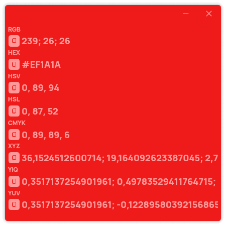

A new version of ColorPicker Max is now available, and it is the version 5.3.0.2307.

## Changelog

### New

- Added translations (#284)
- Added ContextMenu styles (#284)
- Added a context menu in bookmarks (#284)
- Added a recently selected colors section in Selector page (#285)
- Added a color detail window (#286)
- Added the possibility to get color details in Text tool (#286)
- Added the possibility to get color details in Gradient (#286)
- Added the possibility to get color details in Palette (#286)
- Added translations (#287)
- Added tooltips on Details window (#287)
- Added tooltips on pages (#287)
- Added tooltips on user controls (#287)

### Updated

- Updated PeyrSharp.Core (#282)
- Updated PeyrSharp.Env (#283)

## New Details window

We are thrilled to announce the introduction of our new feature, the "Details" window. This exciting addition aims to empower designers, artists, and enthusiasts with a deeper understanding of colors right at their fingertips.

With the "Details" window, users can now explore colors in greater detail by simply right-clicking on a color area in the Text tool, gradient, or palette page. This action triggers a window that unveils a wealth of information about the selected color, including its precise RGB values and hexadecimal code.

By displaying the color's composition in such a detailed manner, the "Details" window enables users to make more informed decisions when selecting and matching colors for their projects. Whether it's designing a logo, creating digital artwork, or planning an aesthetically pleasing color palette, this feature serves as an invaluable resource.

Not only does the "Details" window provide valuable insights, but it also enhances the overall workflow efficiency. No longer do users have to search for color information through separate tools or external resources. With a simple right-click, all the necessary details are instantly presented, allowing for a seamless color exploration experience.

We believe that the "Details" window feature will improve the way users interact with colors in ColorPicker Max. It is our ongoing commitment to empower our users with innovative tools and features that elevate their creative endeavors. We can't wait to see how this enhancement will unlock new possibilities and inspire stunning visual compositions.

## Download

[Click here](https://tinyurl.com/DownloadColorPickerMax) to download ColorPicker Max.

[Learn More](https://leocorporation.dev/store/colorpickermax) about ColorPicker Max.
