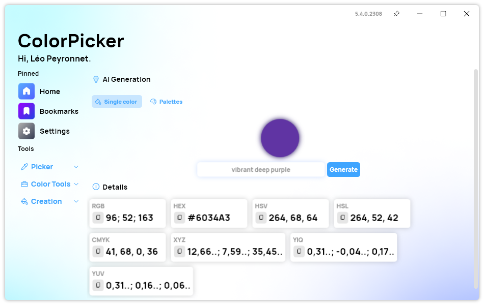
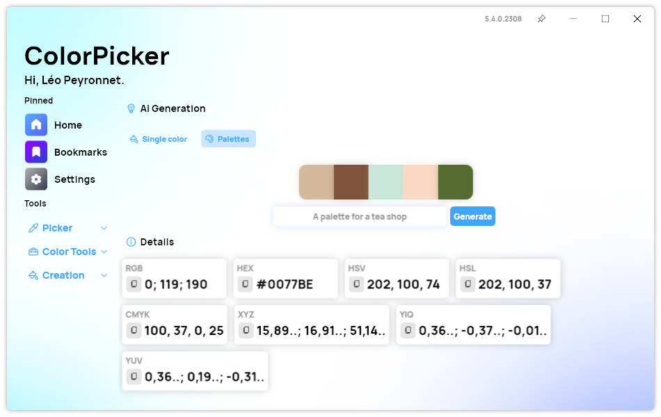

This version brings a new exciting feature to ColorPicker Max: AI Color Generation!

## Introducing AI Color Generation - powered by OpenAI

We are excited to announce a new feature for ColorPicker Max: AI generation. With this feature, you can generate a color or a palette of five colors from a text prompt. For example, you can type "sunset" and get a color or a palette that matches the mood and theme of a sunset. This feature is powered by the OpenAI ChatGPT API, which uses deep learning to create realistic and diverse colors from natural language inputs.

To use this feature, you will need an API Key from OpenAI. You can get one for free by signing up on their website. Once you have your API Key, you can enter it in the settings page of ColorPicker Max. Then, you can access the AI generation feature from the sidebar. You can choose to generate a single color or a palette of five colors.

We hope you enjoy this new feature and have fun creating amazing colors with AI. Please share your feedback and suggestions with us on social media. We are always looking for ways to improve ColorPicker Max and make it the best color picker app for you.

## Changelog

### New

- Added translations
- Added AI Generation page (#294)
- Added the possibility to set an OpenAI API Key (#295)
- Added details section (#296)
- Added AI Color user interface (#296)
- Added the possibility to generate a color from a prompt (#296)
- Added messages when invalid info is provided (#296)
- Added version in title bar
- Added translations (#297)
- Added the possibility to generate a palette of five colors from a prompt (#297)
- Added details in palette section of AI page (#297)
- Added the possibility to select the default model (#298)

### Fixed

- Fixed an issue on start in AI page
- Improved settings UI (#298)
- Fixed an issue with Model selection on start (#298)

### Updated

- Updated PeyrSharp.Env (#292)
- Updated PeyrSharp.Core (#293)
- Updated Synethia for the AI page (#294)

## Download

[Click here](https://tinyurl.com/DownloadColorPickerMax) to download ColorPicker Max.

[Learn More](https://leocorporation.dev/store/colorpickermax) about ColorPicker Max.
