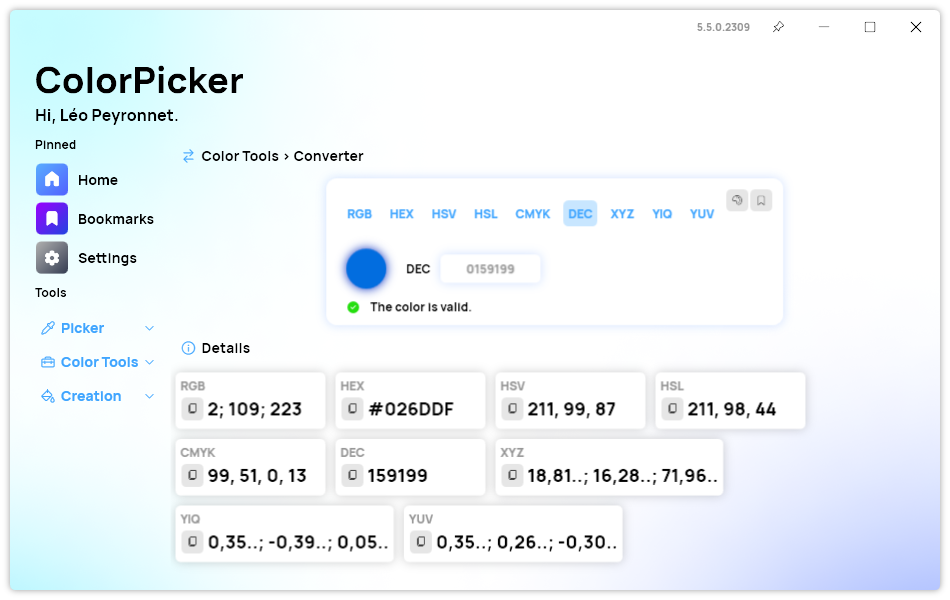
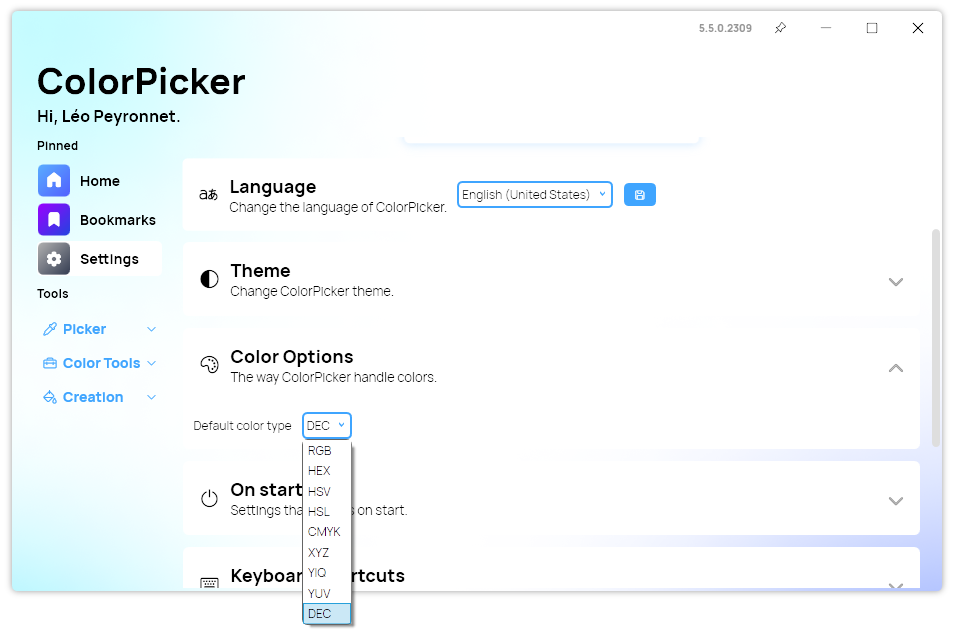

A new version of ColorPicker Max is now available for everyone and it includes the possibility to convert any colors to the decimal format.

## The new decimal color type

We are excited to announce the new feature of ColorPicker Max: The addition of the decimal color type. This feature allows users to work with colors in a more flexible and intuitive way. Users can now convert any color type such as RGB, HEX, HSL, etc to Decimal color type and vice-versa. They can also set the default color type to decimal as well.

What is the decimal color type? It is a way of representing colors using decimal numbers instead of hexadecimal or other formats. For example, the color white can be written as 16777215 in decimal, or FFFFFF in hexadecimal. The decimal color type has some advantages over other formats, such as:

- It is easier to read and write, especially for beginners.
- It is compatible with most programming languages and frameworks.
- It can represent more colors than some other formats, such as 8-bit RGB.

### How to use the decimal color type in ColorPicker Max?

It is very simple. Just follow these steps:

- Click on the "Convert" button on the side bar.
- Choose "DEC" from the list of available color types.
- You will see the decimal value of your selected color in the text box below.
- You can copy the decimal value to your clipboard or save it to your favorites.
- You can also convert any decimal value to any other color type by entering it in the text box and choosing the desired format.

### How to set the default color type to decimal in ColorPicker Max?

If you prefer to use the decimal color type as your default format, you can do so by following these steps:

- Open ColorPicker Max and go to the settings.
- Tap on the "Color Options" section.
- Choose "Decimal" from the list of available color types.

We hope you enjoy this new feature and find it useful for your projects. Please let us know what you think and share your feedback with us.

## Changelog

### New

- Added translations (#309)
- Added placeholder in AI page (#309)
- Added Decimal color representation (#310)
- Added Decimal color type in AI Page (#311)
- Added Decimal color type in Chromatic wheel page (#311)
- Added Decimal color type in Converter page (#311)
- Added Decimal color type in Gradient page (#311)
- Added Decimal color type in Palette page (#311)
- Added Decimal color type in Selector page (#311)
- Added Decimal color type in Text tool (#311)
- Added the possibility to convert from decimal type (#312)
- Added the possibility to copy a color to decimal in history (#310)
- Added the possibility to set the decimal type as default (#313)

### Fixed

- Fixed an issue when pasting text
- Fixed an issue in Converter page
- Fixed an issue when pasting a decimal color

### Updated

- Updated PeyrSharp.Env (#307)
- Updated PeyrSharp.Core (#308)
- Updated tooltips (#311)
- Default color type now applies to gradient page (#313)
- Default color type is now used in Palette history
- Default color type is used when copying a color in history

## Download

[Click here](https://tinyurl.com/DownloadColorPickerMax) to download ColorPicker Max.

[Learn More](https://leocorporation.dev/store/colorpickermax) about ColorPicker Max.
