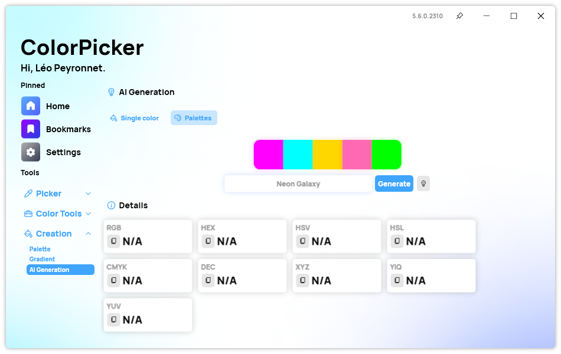
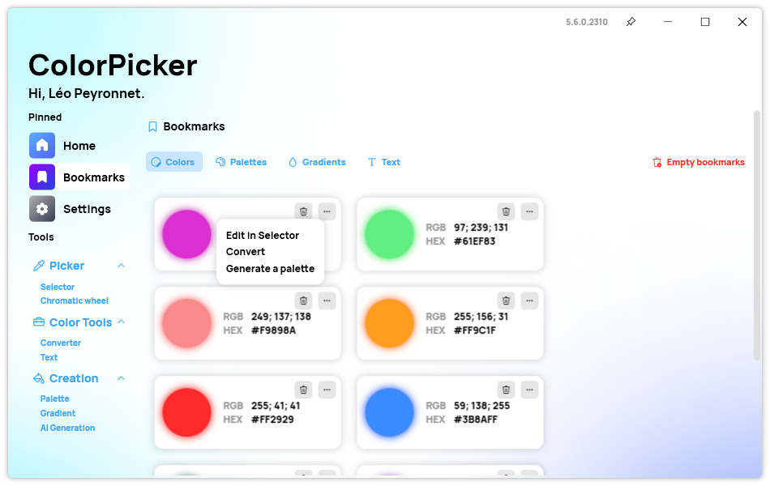

A new version of ColorPicker Max is now available for everyone and it brings several improvements to the app, making it more polished.

## AI Page Enhancements

We added some enhancements to the AI page to make it more user-friendly and fun. First, we have added the possibility to bookmark a color directly from the AI page, without having to switch to the Selector page. Just click on the bookmark icon next to the color you like, and it will be saved in your bookmarks. Second, we have added a list of suggested prompts that you can use to get started with the AI. Just click on one of the prompts, and the app will generate a color for you. Third, in the settings of the app, you can now get the available OpenAI models for your account and use them to generate colors.

These enhancements make the AI page more interactive and enjoyable, and allow you to explore different possibilities of color generation with artificial intelligence.

## New Popup Menu in Bookmarks

In this version, we have added a new popup menu in the Bookmarks page that gives you more options for your colors. Just click on the "..." next to a color you have bookmarked, and you will see a menu with three options: Edit in Selector, Convert, and Generate a Palette. The first option takes you to the Selector page allowing you to tweak the color. The second option takes you to the Converter page, so you can quickly convert the color to any other color types. Finally, the third option allows you to generate a color palette from the selected color.

## Changelog

### New

- Added the possibility to bookmark a color in AI page (#324)
- Added suggested prompts list (#325)
- Added the possibility to get random prompts (#325)
- Added the possibility to get all available models (#326)
- Added translations (#327)
- Added "More" button in Bookmarks (#327)
- Added "Convert" option in "More" popup (#327)
- Added "Generate palette" option in "More" popup (#327)

### Fixed

- Fixed an issue with popup in dark mode

### Updated

- Updated PeyrSharp.Env (#318)
- Updated PeyrSharp.Core (#319)
- Updated Betalgo.OpenAI (#322)

## Download

[Click here](https://tinyurl.com/DownloadColorPickerMax) to download ColorPicker Max.

[Learn More](https://leocorporation.dev/store/colorpickermax) about ColorPicker Max.
