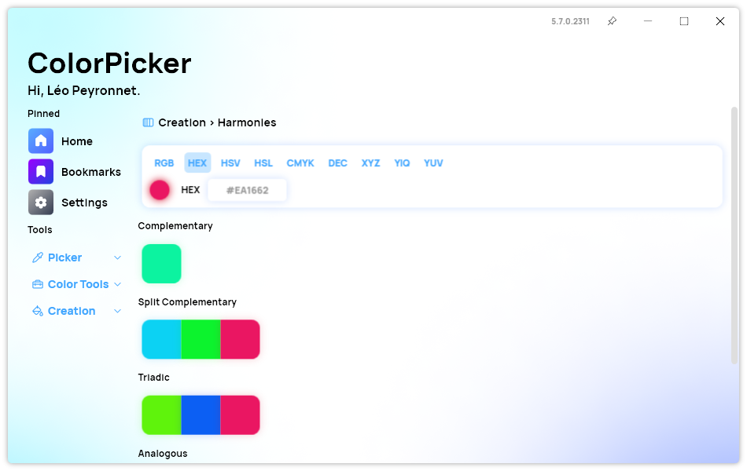

A new version of ColorPicker Max is now available and it brings a new feature: Color Harmonies.

## Color Harmonies - a new way to generate colors

In the ever-evolving world of design and creativity, staying ahead of the curve is essential. With the latest update to ColorPicker Max, we are thrilled to introduce a groundbreaking feature that will revolutionize the way you generate colors: Color Harmonies. This new addition is set to redefine your color selection process and open up a world of possibilities for your designs. Let's dive in and explore the exciting features and benefits of Color Harmonies in ColorPicker Max.

### Exploring the World of Color Harmonies

Let's delve into the heart of this exciting update. Color Harmonies are color combinations that are visually appealing and pleasing to the eye. They're based on specific relationships between colors on the color wheel. With ColorPicker Max, you can effortlessly generate these harmonious color schemes. Here's a glimpse of the new possibilities:

1. **Complementary Colors**: Need a color that will make your design pop? Find the perfect complementary color that creates a strong contrast.

2. **Split Complementary Colors**: For a more subtle contrast, split complementary colors offer a harmonious blend that adds depth and interest to your design.

3. **Triadic Colors**: Explore triadic color schemes that bring vibrancy and balance to your projects.

4. **Analogous Colors**: Discover color combinations that are neighbors on the color wheel, creating a cohesive and visually pleasing look.

5. **Monochromatic Colors**: Simplify your color palette with harmonious monochromatic schemes that exude elegance and simplicity.

6. **Set Harmonies Page as Default**: If you find yourself frequently using color harmonies, you can now set the Harmonies page as your default, saving you time and effort.

### Elevate Your Design Game

ColorPicker Max's new Color Harmonies feature is a game-changer for designers and creatives. Whether you're designing a website, a logo, or any creative project, this update provides you with a wide array of color options that will take your designs to the next level.

Say goodbye to the days of endlessly searching for the right color combinations. With Color Harmonies, you can effortlessly create harmonious color palettes that will captivate your audience and bring your creative visions to life.

So, why wait? Update to ColorPicker Max today and unlock the world of Color Harmonies. Your designs will thank you!

## Changelog

### New

- Added translations (#332)
- Added new Harmonies page (#332)
- Added the possibility to navigate to Harmonies page (#332)
- Added Color selection section (#332)
- Added the possibility to get complementary color (#333)
- Added the possibility to get split complementary color (#334)
- Added the possibility to get triadic colors (#335)
- Added translations (#336)
- Added the possibility to get analogous colors (#336)
- Added the possibility to get monochromatic colors (#338)
- Added the possibility to set Harmonies page as default page (#339)

### Fixed

- Fixed an issue with Split complementary colors (#334)
- Fixed an issue with Synethia

## Download

[Click here](https://tinyurl.com/DownloadColorPickerMax) to download ColorPicker Max.

[Learn More](https://leocorporation.dev/store/colorpickermax) about ColorPicker Max.
