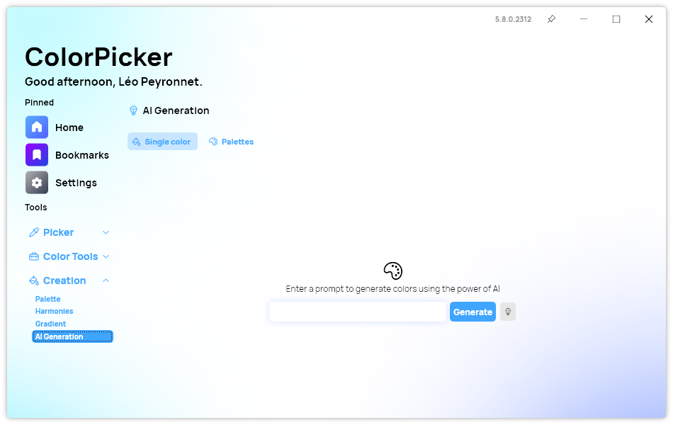
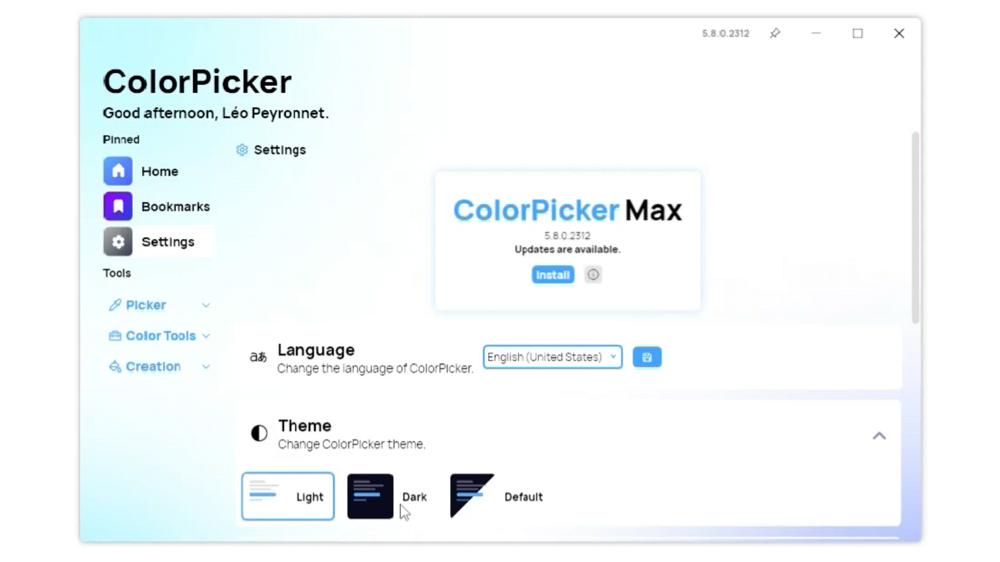

A new version of ColorPicker Max is now available and it brings several improvements to the app.

## New placeholder in AI page

When starting the AI Generation page, a placeholder will now be displayed while the details panel is now hidden if no color is generated or selected.

## Instant theme switching

You no longer need to restart the app to change its theme - the change is now reflected immediately.

## Changelog

### New

- Added the possibility to bookmark a color in Harmonies page (#351)
- Added translations (#352)
- Added placeholder in AI Page color section (#352)
- Added placeholder in AI Page palette section (#352)
- Added instant theme switching (#353)

### Fixed

- Fixed tab color issue when changing theme (#353)
- Fixed an issue with nav bar when switching theme (#353)
- Fixed color issue in dark theme
- Fixed transparent window issue
- Fixed theme not changing on first run

### Updated

- Updated Betalgo.OpenAI (#348)
- Updated PeyrSharp.Env (#349)
- Updated PeyrSharp.Core (#350)
- Updated theme file

## Download

[Click here](https://tinyurl.com/DownloadColorPickerMax) to download ColorPicker Max.

[Learn More](https://leocorporation.dev/store/colorpickermax) about ColorPicker Max.
