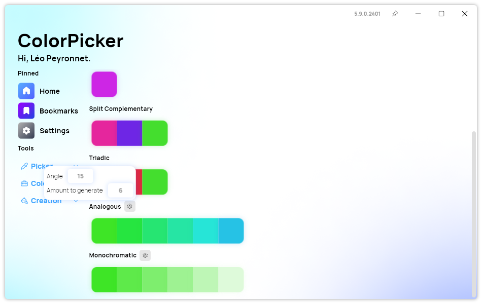

A new version of ColorPicker Max is now available and it brings new customization options alongside several fixes and improvements.

## Harmonies Options

We are proud to introduce new customization options in the Harmonies page: You can now specify the amount of colors to generate, the step and angle to use for color generation. These new options give you more control over the way ColorPicker generates colors.

## Changelog

### New

- Added RGB separator system (#360)
- Added translations (#360)
- Added the possibility to set a custom RGB separator (#360)
- Added the possibility to set the angle for analogous color harmonies (#361)
- Added the possibility to set the steps for monochromatic color harmonies (#362)
- Added the possibility to set the number of analogous colors to generate (#363)

### Fixed

- Fixed missing "#" in front of HEX colors (#358)
- Fixed unsorted AI models list (#359)

### Updated

- Updated copyright years (#364)

## Download

[Click here](https://tinyurl.com/DownloadColorPickerMax) to download ColorPicker Max.

[Learn More](https://leocorporation.dev/store/colorpickermax) about ColorPicker Max.
