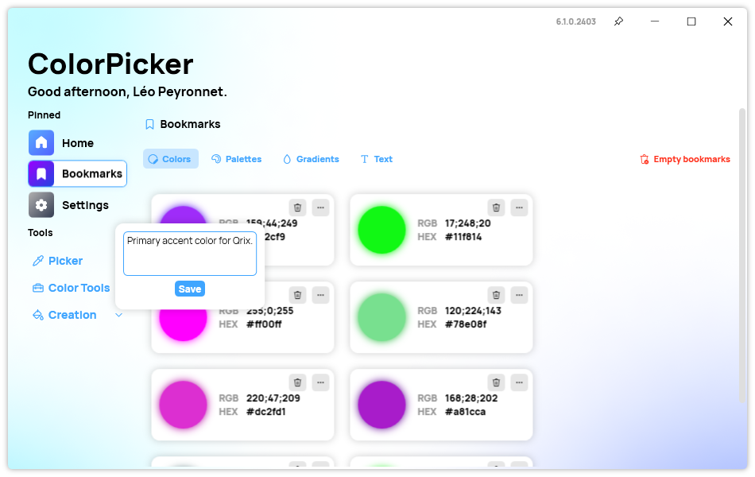
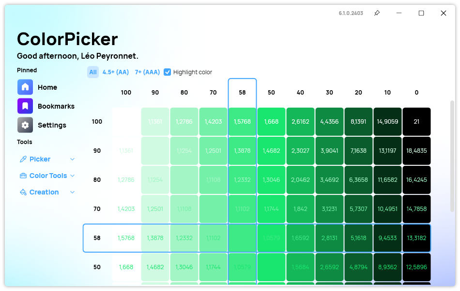
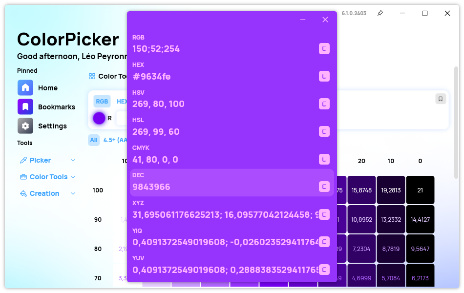

A new version of ColorPicker Max is now available and it brings the ability to add a note in your bookmarks.

## Bookmark notes

In its latest update, ColorPicker Max introduces the ability to add notes to color bookmarks. This enhancement empowers users to not only catalog their favorite colors but also annotate them with quick, insightful notes. This seemingly small addition has a profound impact on workflow efficiency and creative collaboration. Indeed, designers often work on multiple projects simultaneously, each with its own color scheme and design requirements.
By annotating color bookmarks with project-specific notes, designers can maintain clarity and context throughout their workflow.

To get started with this feature, click on the "...", then on "Add a note".

## Other improvements

### Color Grid

It is now possible to highlight the original color in the color grid page. This makes it more easy to identify the best color combinations possible.

### Color Details

We also added the ability to view and copy the DEC value of a color in the color details window.

## Changelog

### New

- Added bookmarks note system (#395)
- Added translations (#395)
- Added the possibility to create notes on color bookmarks (#395)
- Added shortcut to note (#395)
- Added placeholder when clearing the Image Extractor (#396)
- Added DEC section to color details (#397)
- Added the possibility to highlight selected color in Grid (#398)
- Added the possibility to toggle highlight (#398)

### Fixed

- Fixed an issue when removing a bookmark (#395)
- Fixed an issue in dark mode

### Updated

- Updated dependencies
- Improved writing experience in bookmark note

## Download

[Click here](https://tinyurl.com/DownloadColorPickerMax) to download ColorPicker Max.

[Learn More](https://leocorporation.dev/store/colorpickermax) about ColorPicker Max.
