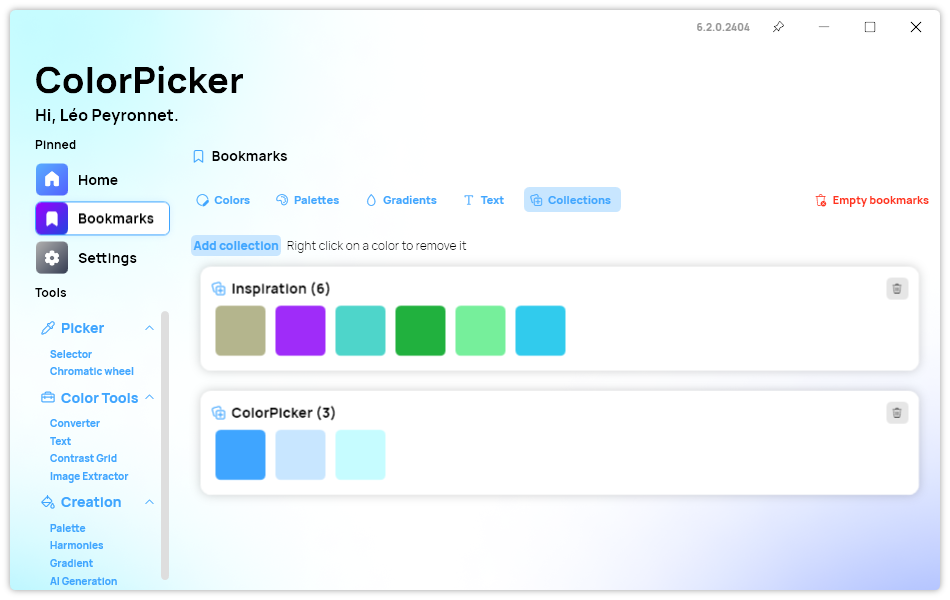
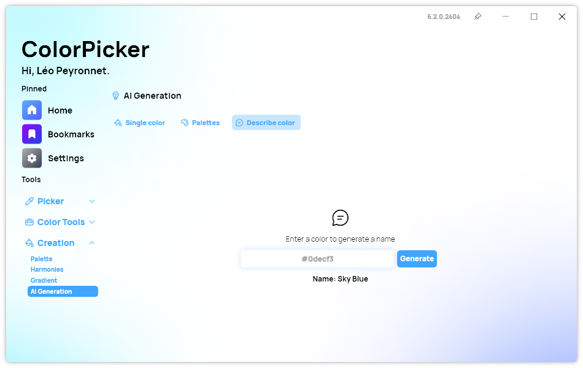

A new version of ColorPicker is now available, and it is the version 6.2.0.2404. This version brings several features to the app, like the new color collections, and new AI color name generator.

## Color Collections

ColorPicker Max introduces an innovative Color Collections feature, revolutionizing the way you organize and utilize your favorite hues. Seamlessly integrated into the app's versatile toolkit, this feature empowers you to curate personalized collections of colors, streamlining the process of accessing and utilizing your preferred palettes. Whether assembling a spectrum for a design project or simply saving inspirational colors for future use, Color Collections offers unparalleled convenience and efficiency. With the ability to effortlessly add, remove, and categorize colors, you can now unleash your creativity with unparalleled ease!

## AI Name Generator

We are also happy to announce the new Color Name AI Generator feature: You simply have to input any color, and the intelligent AI algorithm swiftly generates a fitting name. Gone are the days of struggling to articulate the essence of a shade; now, you can effortlessly obtain descriptive and imaginative names for every hue in your palette. Whether it's a vibrant cerulean blue or a soft blush pink, the Color Name AI Generator provides instant inspiration, enabling you to communicate their vision with clarity and precision.

## Changelog

### New

- Added translations (#403)
- Added "Describe" feature of AI page (#403)
- Added the possibility to copy name (#403)
- Added translations (#404)
- Added CollectionItem (#404)
- Added the possibility to create collections (#404)
- Added the possibility to a color to a collection in Select page (#404)
- Added new collection UI to Converter page (#404)
- Added new collection UI to Harmonies page (#404)
- Added Delete message (#404)

### Fixed

- Fixed Index out of range issue (#404)
- Fixed menu refresh issue (#404)
- Fixed a navigation issue in Bookmarks

### Updated

- Updated namespace syntax
- Improved collection UI (#404)

## Download

[Click here](https://tinyurl.com/DownloadColorPickerMax) to download ColorPicker Max.

[Learn More](https://leocorporation.dev/store/colorpickermax) about ColorPicker Max.
