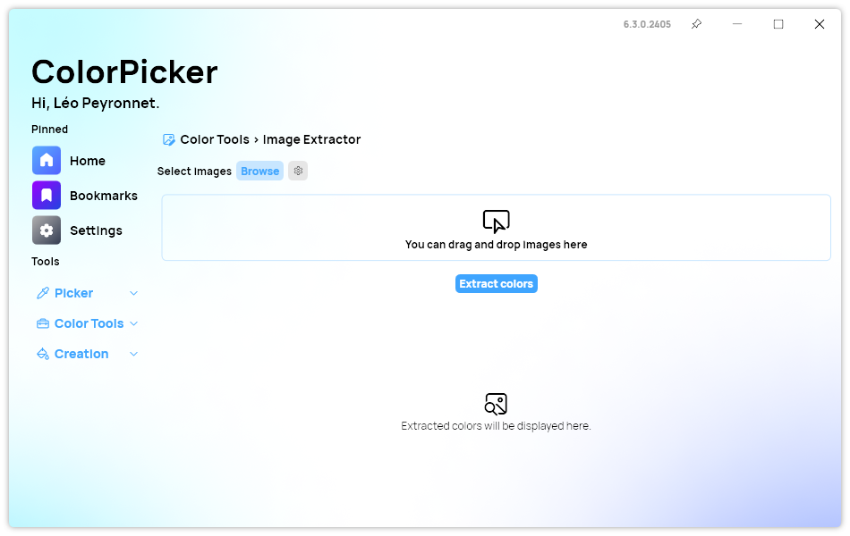

A new version of ColorPicker is now available, and it is the version 6.3.0.2405. We added missing startup options, redesigned the Image Color Extractor page, and much more!

## Improved Image Color Extractor

The Image Color Extractor page of ColorPicker Max has undergone through a redesign, now offering enhanced user functionality and efficiency. We added a new drag and drop area, providing users with seamless access to import images directly onto the platform. This intuitive feature eliminates the need for cumbersome navigation, allowing for a smoother workflow. Moreover, the redesign introduces the convenient option to drop images directly from the file explorer, further streamlining the image extraction process. Additionally, the CSV export popup has been meticulously redesigned, prioritizing user experience by presenting a more intuitive layout and enhanced readability.

## Details window

As you may know, you can pin the ColorPicker Max window so it always stays on top of others. This feature was not available in the Color Details window, and this is why we added the possibility to do it with this version. You will now notice a "pin" icon in the title bar, allowing you to easily switch between the different states.

## Other improvements

We also added the possibility to set the Contrast Grid and the Image Color Extractor as the default startup page. We also made several improvements to some areas of the app, making it more consistent with our design language.

## Changelog

### New

- Added new startup options (#411)
- Added new tooltip design (#412)
- Added translations (#413)
- Added Drag and drop section (#413)
- Added drag and drop when images are already selected (#413)
- Added the possibility to pin "Details" window (#414)
- Added new hover effects in "Details" window (#414)
- Redesigned "Export CSV" popup (#415)

## Download

[Click here](https://tinyurl.com/DownloadColorPickerMax) to download ColorPicker Max.

[Learn More](https://leocorporation.dev/store/colorpickermax) about ColorPicker Max.
