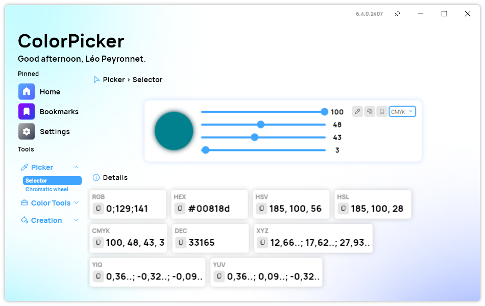
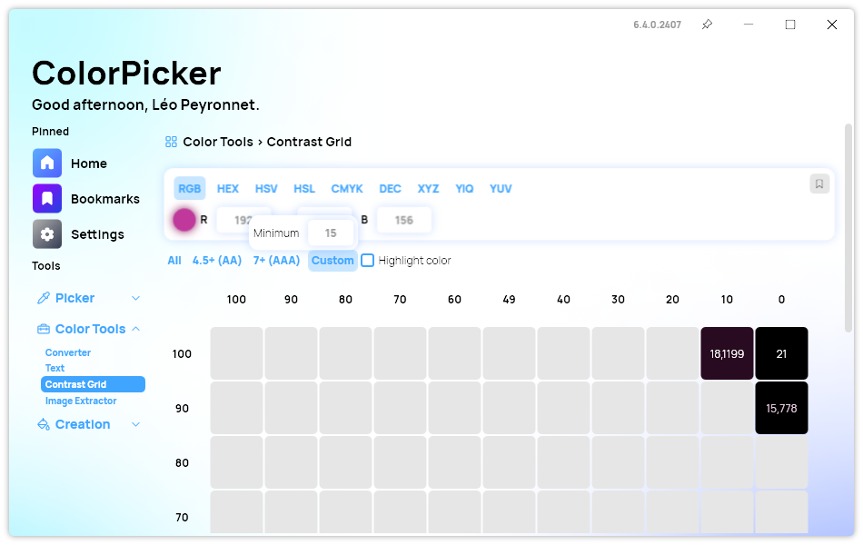
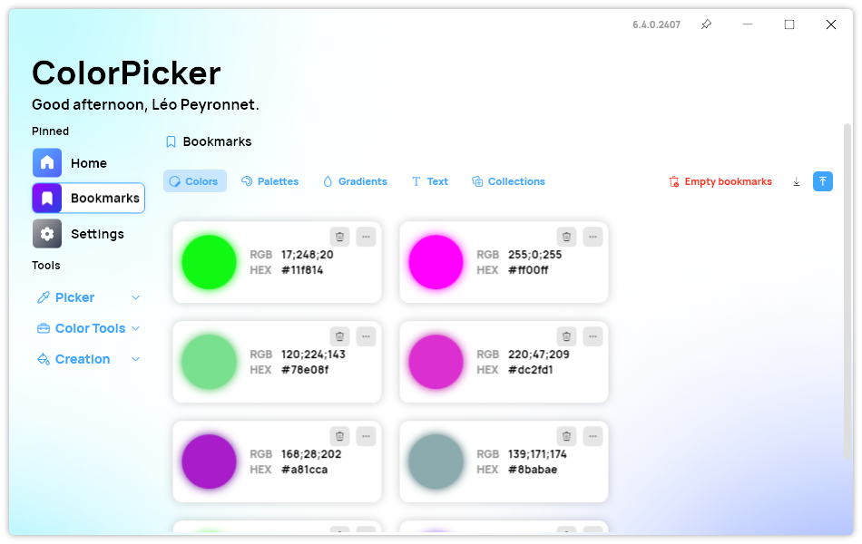

A new version of ColorPicker Max is now available, and it is the version 6.4.0.2407. This version introduces the ability for users to export and import bookmarks, the possibility to add a custom filter in the "Contrast Grid page", and more. Let's dive in!

## CMYK Option in the UI

The latest update to ColorPicker Max introduces a much-anticipated feature for designers and color enthusiasts alike: the inclusion of the CMYK option directly in the user interface. This enhancement is part of our ongoing commitment to providing powerful, intuitive tools that make color selection and manipulation easier and more efficient than ever before.

With version 6.4.0.2407, users can now easily switch to CMYK color mode, allowing for precise control over cyan, magenta, yellow, and black channels. This is especially beneficial for those working in print media, where CMYK is the standard. The integration of CMYK into the UI ensures that users can seamlessly transition between different color models without needing to rely on external tools or complex conversions. This feature streamlines the workflow, saving time and reducing the likelihood of errors in color selection and application.

The latest release of ColorPicker Max 6.4.0.2407 comes with a range of new features designed to enhance your workflow and offer more control over your projects. From improved contrast analysis tools to advanced bookmark management, these updates are set to revolutionize how you work with color.

## Custom Filter in Contrast Grid

The new version also introduces the possibility to specify a custom filter in the Contrast Grid. This feature empowers users to apply personalized criteria when analyzing color contrasts, tailoring the results to meet specific project needs. By allowing more granular control over contrast evaluations, users can ensure that their designs align with their unique aesthetic and functional goals. One of the key updates is the addition of the Min Contrast popup. This feature allows users to quickly check the minimum contrast ratio required for their designs, ensuring compliance with accessibility standards. With a simple click, users can access this popup and verify whether their color combinations meet the necessary contrast requirements, thus enhancing readability and user experience across different media.

## Export and Import Bookmarks

Managing your favorite colors and palettes is now more efficient with the added functionality to export and import bookmarks. Users can easily save their preferred color settings and transfer them between different devices or share them with team members. This capability not only streamlines collaboration but also ensures that your personalized color configurations are always at your fingertips, no matter where you are working.

## Changelog

### New

- Added missing tooltips in Harmonies page (#419)
- Added CMYK option in UI (#420)
- Added CMYK selector sliders in Selector page (#420)
- Added translations (#421)
- Added Min Contrast popup (#421)
- Added the possibility to specify a custom filter in Contrast Grid (#421)
- Added the possibility to export Bookmarks (#422)
- Added the possibility to import Bookmarks (#422)
- Added tooltips in Bookmarks page (#422)

## Download

[Click here](https://tinyurl.com/DownloadColorPickerMax) to download ColorPicker Max.

[Learn More](https://leocorporation.dev/store/colorpickermax) about ColorPicker Max.
