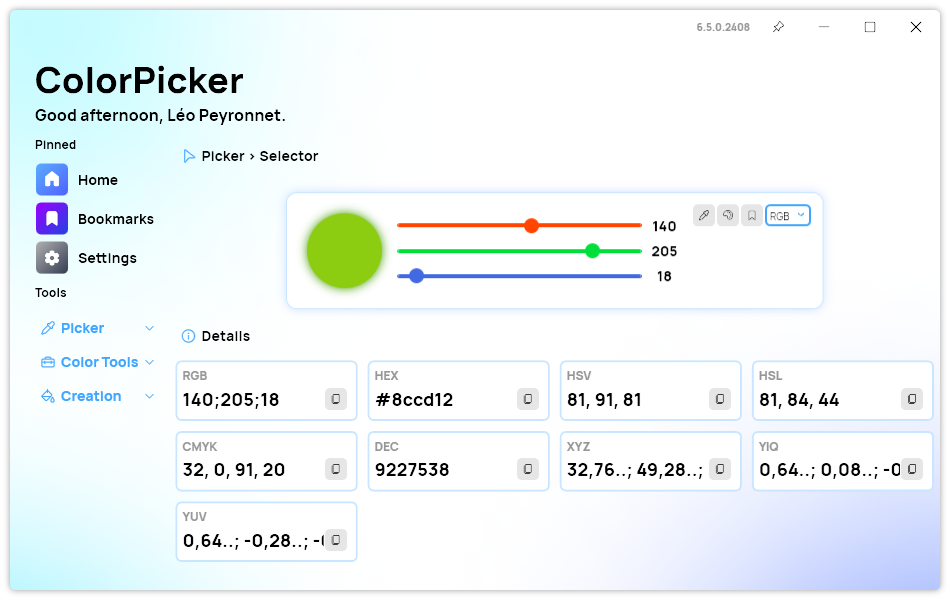
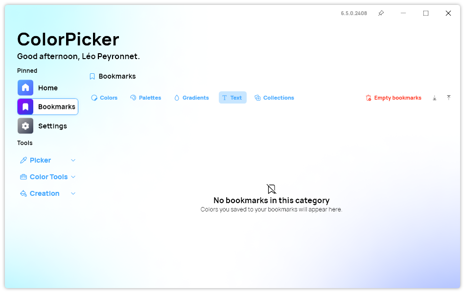
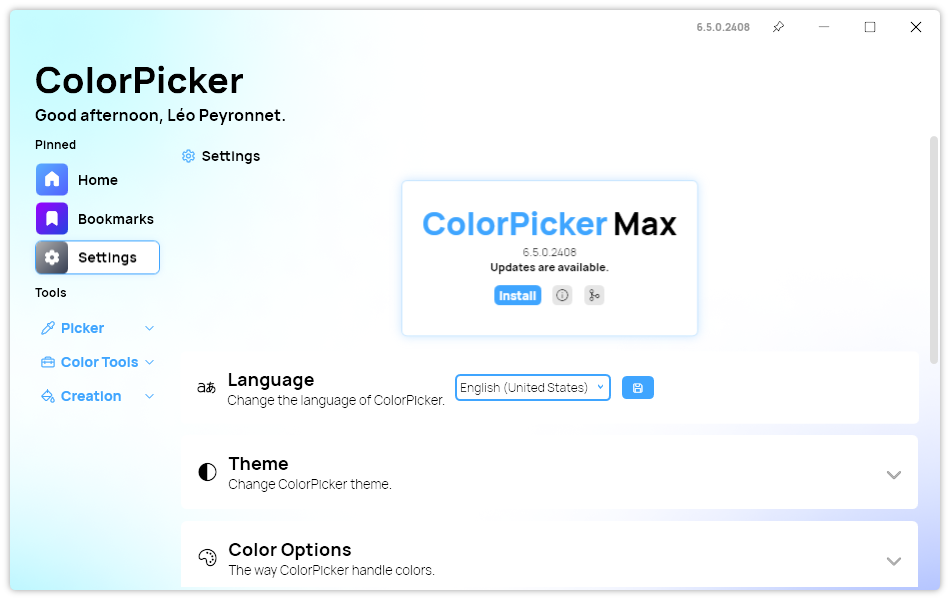

## New Color Details section

In the latest update of ColorPicker, users will notice a significant enhancement in the Details section, designed to streamline their color manipulation experience. The new design introduces a more intuitive and visually appealing interface, making it easier than ever to access and understand detailed color information.

## Placeholders in Bookmarks page

We also added thoughtfully designed placeholders on the Bookmarks page, enhancing the user experience even when no colors have been bookmarked yet. These new placeholders are not only visually appealing but also serve as subtle guides, encouraging users to explore the app's bookmarking feature.

## Other improvements

One notable enhancement is the addition of new tooltips on the title bar, which provide clear and concise explanations of each icon's function, making navigation more intuitive, especially for new users. Additionally, the update addresses previous inconsistencies in tooltip behavior throughout the app, ensuring that tooltips now appear uniformly and accurately across all sections, offering a more cohesive and polished interface.

Another valuable addition is the new link to the app's GitHub repository in the About section of the Settings page. This link makes it easier for users to access the source code, contribute to the project, or report issues directly, fostering a stronger community around the app.

## Changelog

### New

- Added translations (#428)
- Added tooltips in MainWindow (#428)
- Added tooltips in Color Window (#428)
- Added new About section (#429)
- Added Placeholder resources (#430)
- Added placeholder in Bookmarks (#430)
- Added Placeholder when deleting an item (#430)
- Added new Details section on Selector page (#431)
- Added new Details section on Converter page (#431)
- Added new Details section on Chromatic page (#431)
- Added new Details section on AI page (#431)
- Added missing translations

### Fixed

- Fixed tooltip style issues (#428)
- Fixed wrong tooltips in Bookmarks

## Download

[Click here](https://tinyurl.com/DownloadColorPickerMax) to download ColorPicker Max.

[Learn More](https://leocorporation.dev/store/colorpickermax) about ColorPicker Max.
