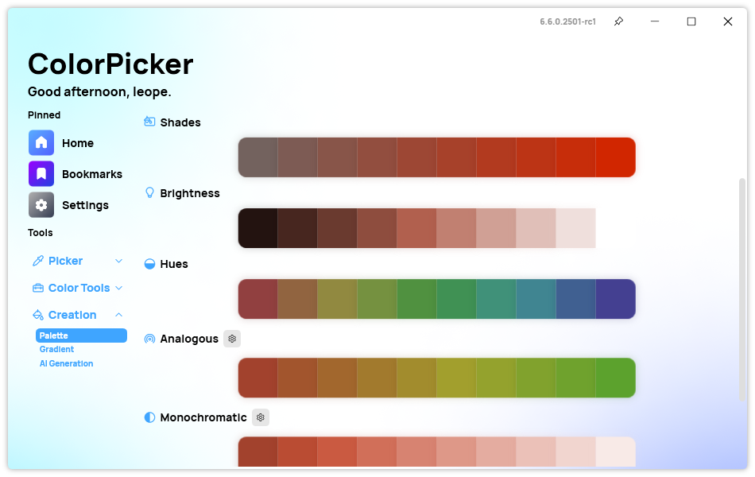
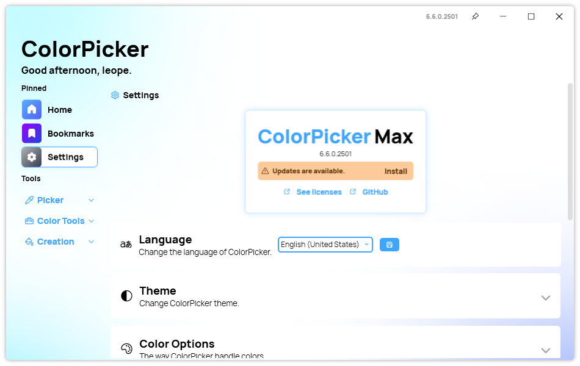
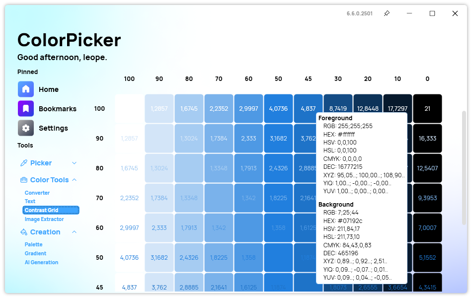

## New Harmonies section

We also added a new Harmonies section in the Palette page, enhancing the user experience even when no colors have been bookmarked yet. These new placeholders are not only visually appealing but also serve as subtle guides, encouraging users to explore the app's bookmarking feature. You will also notice that we removed the Harmonies page from the app to merge all of its features into the Palette page. This change will make it easier for users to access all the color harmonies and palettes in one place.

## New Update section

In the latest update of ColorPicker, users will notice a significant enhancement in the Update section, designed to streamline experience. The new design introduces a more intuitive and visually appealing interface, making it easier than ever to access and understand detailed color information.

## Other improvements

One notable enhancement is the addition of new tooltips on the Contrast Grid page, which provide quick information about the foreground and background color contrast. We also fixed an alignment issue in the margin of the app, ensuring a more cohesive and polished interface.

## Changelog

## New

-   Added tooltips in Contrast Grid page (#441)
-   Added new Theme resources for new Update section (#442)
-   Added new Update section (#442)
-   Added Chinese locales to Setup
-   Added Harmonies sections in Palette page (#443)

## Fixed

-   Fixed wrong padding in AI settings (#440)
-   Fixed theme not applying to Update section (#442)
-   Fixed margin aligment issue (#443)

## Updated

-   Updated Betalgo.OpenAI (#439)
-   Removed Harmonies page (#443)
-   Removed Harmonies from Synethia (#443)

## Download

[Click here](https://tinyurl.com/DownloadColorPickerMax) to download ColorPicker Max.

[Learn More](https://leocorporation.dev/store/colorpickermax) about ColorPicker Max.
