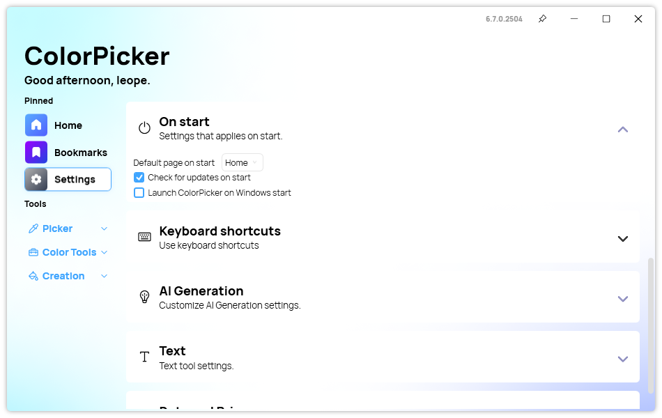

## Launch during Windows startup

One of the most convenient new features in this version is the ability to launch the app automatically during Windows start. When this feature is toggled on, the application will start minimized in the system tray area, allowing users to access it instantly without the need to manually launch it. This means that users can immediately use their selected keyboard shortcuts to pick colors or perform other tasks right from the start. Additionally, the notify icon in the system tray comes with a context menu that provides quick access to essential functions. Users can easily show or hide the main window and even quit the app directly from this menu, enhancing the overall efficiency and user experience.

## Quality of Life Improvements

The Details section has been significantly improved with the addition of a dedicated Details Control. This feature provides a more organized and detailed view of color information, making it easier for users to analyze and work with their selected colors. The Details section has been moved to this dedicated control, ensuring a cleaner and more efficient user interface.

Several bug fixes have also been implemented to improve the overall stability and performance of ColorPicker Max. Issues such as scroll bars not working when the window is maximized and a crash issue in the AI page have been resolved, ensuring a smoother user experience. Additionally, a bug that caused placeholders to remain visible in Bookmarks has been fixed, enhancing the usability of the bookmarking feature.

## Changelog

### New

-   Added new ComboBox style (#453)
-   Added ComboBox Editabled style (#453)
-   Added translations (#454)
-   Added the possibility to start the app on Windows start (#454)
-   Added Notify icon (#454)
-   Added Silent mode (#454)
-   Added Details Control (#455)
-   Moved Details section to dedicated control (#455)

### Fixed

-   Fixed scroll bars not working when Window is maximized (#449)
-   Fixed crash issue in AI page (#451)
-   Fixed placeholder still visible in Bookmarks (#452)

### Updated

-   Updated Licenses

## Download

[Click here](https://tinyurl.com/DownloadColorPickerMax) to download ColorPicker Max.

[Learn More](https://leocorporation.dev/store/colorpickermax) about ColorPicker Max.
