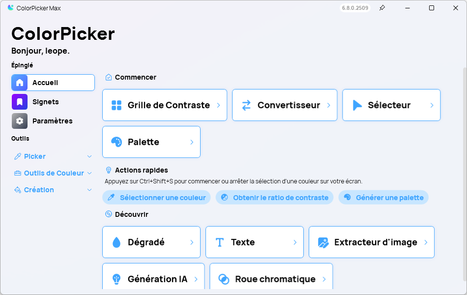
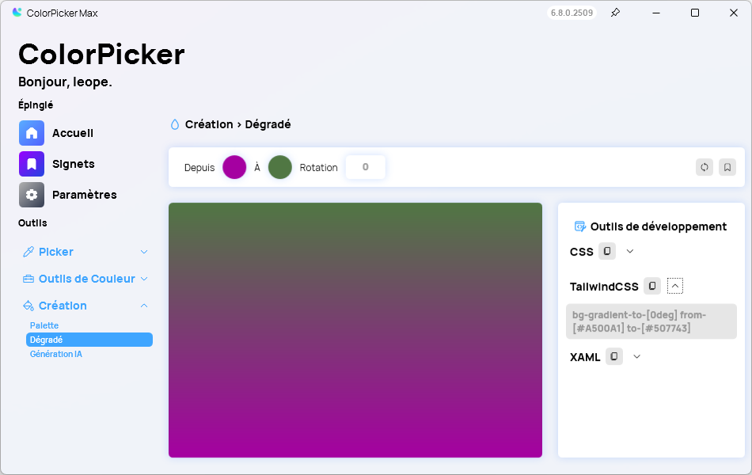

A new version of ColorPicker Max is now available. This release introduces a modern Mica design, enhancing the visual appeal and user experience of the application. The update also includes the possibility to export a gradient to Tailwind CSS, making it easier for developers to integrate gradients into their projects. Additionally, several bug fixes have been implemented to improve the overall stability and performance of ColorPicker Max.

## Mica Design

One of the standout features of this update is the introduction of Mica design. Mica is a new design material introduced by Microsoft that provides a translucent, blurred background effect, allowing the app to blend seamlessly with the user's desktop environment.

## Export Gradient to Tailwind CSS

Another significant addition in this version is the ability to export gradients directly to Tailwind CSS. This feature simplifies the process for developers who want to use custom gradients in their web projects, allowing them to generate the necessary CSS code with just a few clicks.

## Changelog
### New

- Added locales (#468)
- Added TailwindCSS in Gradient page Dev Tools (#468)
- Added new Mica Window (#469)
- First Run window now uses Mica (#469)

### Fixed

- Fixed crash when using invalid API Key (#467)
- Fixed an issue when closing the MainWindow

### Updated

- Migrated Betalgo

## Download

[Click here](https://tinyurl.com/DownloadColorPickerMax) to download ColorPicker Max.

[Learn More](https://leocorporation.dev/store/colorpickermax) about ColorPicker Max.
