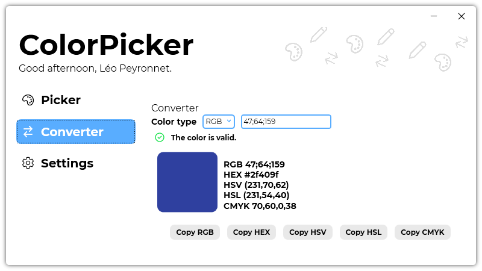

A new version of ColorPicker is now available, and it is the version 3.1.0.2105.

## Changelog
### New
- Added the possibility to convert HSL colors (#3)
- Added the possibility to copy a HSL color (#3)
- Added the possibility to convert CMYK colors (#4)
- Added the possibility to copy CMYK color (#4)
- Added the possibility to set a custom separator for RGB colors (#5)
- Added the possibility to use lower or upper cases for HEX colors (#6)
### Fixed
- Fixed: HSV TextBoxes in Converter page don't follow the theme (#2)
- Fixed an issue with dark theme- Fixed an issue when copying an hex color
### Updated
- Updated LeoCorpLibrary
- Updated Setup

## Download

[Click here](https://tinyurl.com/DownloadColorPicker) to download ColorPicker.

## Screenshot

