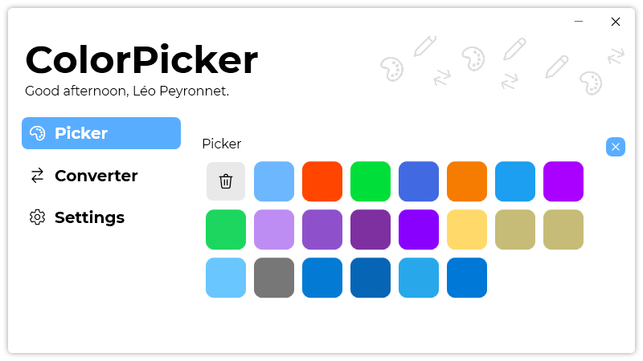

A new version of ColorPicker is now available and it is the version 3.2.0.2106.

## Changelog
### New
- Redesigned "About" section in settings (#13)
- Added the possibility to export settings (#14)
- Added the possibility to import settings (#14)
- Added the possibility to enable/disable keyboard shortcuts (#15)
- Added a list of recently copied colors (#16)
### Updated
- Updated LeoCorpLibrary

## Download

[Click here](https://tinyurl.com/DownloadColorPicker) to download ColorPicker.

## Screenshot

