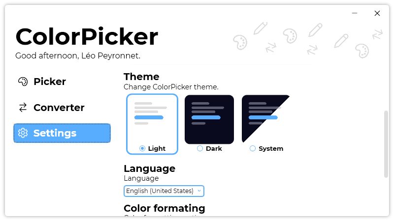

A new version of ColorPicker is available and it is the version 3.3.0.2107.

## Changelog
### New
- Added translations
- Added the possibility to set the theme to system (#27)
- Added new theme assets (#28)
- Redesigned the theme picking UI (#28)
- Added new keyboard shortcuts (#29)
- Added the possibility to generate a random color (#30)
### Updated
- Updated LeoCorpLibrary
- Updated shortcut guide message (#29)

## Download

[Click here](https://tinyurl.com/DownloadColorPicker) to download ColorPicker.

## Screenshot
