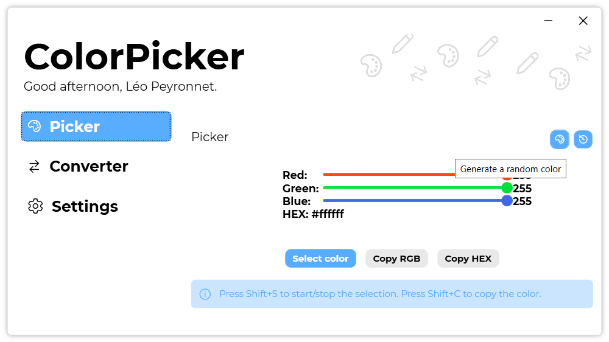

A new version of ColorPicker is available and it is the version 3.4.0.2108.

## Changelog
### New
- Added translations
- Added tooltips (#40)
- Added animations on Tab buttons (#41)
### Fixed
- Fixed: Can't update ColorPicker (#39)
### Updated
- Updated LeoCorpLibrary
- Updated Setup
- Updated README links (#42)

## Download

[Click here](https://tinyurl.com/DownloadColorPicker) to download ColorPicker.

## Screenshot

