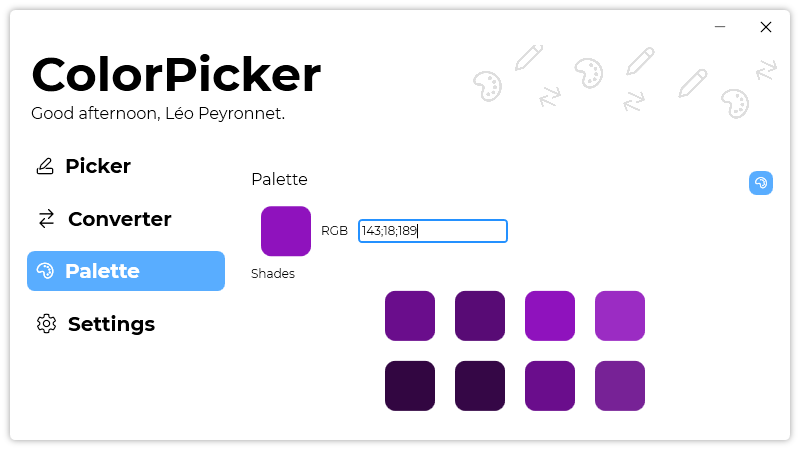

A new version of ColorPicker is now available, and it is the version 3.5.0.2109.

## Changelog
### New
- Added new animation on "Converter" icon (#52)
- Added translations
- Added a "Color palette" UI (#53)
- Added a button to generate a random color (#53)
- Added the possibility to copy the generated colors (#53)
- Added tooltips (#53)
- Made default theme "System" (#54)
### Fixed
- Fixed: On scaled screens, MiniPicker isn't following the cursor correctly (#50)
- Fixed: HSL in English should be HSB (#51)
- Fixed an issue with MiniPicker (#50)
### Updated
- Updated LeoCorpLibrary
- Updated ColorHelper

## Download

[Click here](https:/tinyurl.com/DownloadColorPicker) to download ColorPicker.

## Screenshot
