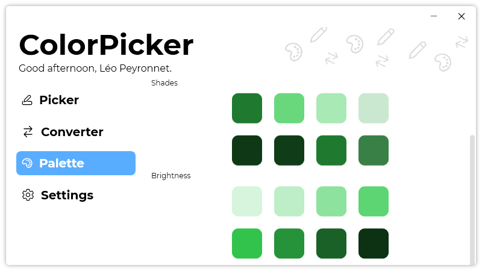

A new version of ColorPicker is now available and it is the version 3.6.0.2110.

## Changelog
### New
- Added a "Brightness" color palette (#63)
- Added tooltips in "Palette" page (#63)
- Added title for the "Brightness" section (#63)
- Added the possibility to enter an HEX value in "Palette" page (#64)
- Added an history in "Palette" page (#65)
- Added the possibility to copy colors from history (#65)
- Added tooltips in history (#65)
- The "History" button is hidden when the history is empty (#66)
- Color Palettes are now added manually to history (#65)
### Fixed
- Fixed crash issues
### Updated
- Updated LeoCorpLibrary

## Download

[Click here](https://tinyurl.com/DownloadColorPicker) to download ColorPicker.

## Image
