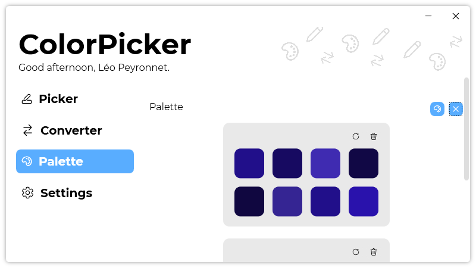

A new version of ColorPicker is now available, and it is the version 3.7.0.2111.

## Changelog
### New
- Added translations
- Added the possibility to remove an item from the history in "Palette" page (#74)
- Added the possibility to regenerate a color palette from history (#75)
- Added the possibility to copy color palette as HEX when HEX is selected (#76)
- Added HEX values in tooltips in "Palette" page (#77)
- Added HEX values in tooltips in the history of the "Palette" page (#77)
### Fixed
- Fixed: "Generate random color" button doesn't work in "HEX" mode (#72)
- Fixed a typo issue where the HEX color wasn't correctly displayed in the history
- Fixed: "Add to history" button can add multiple times the same color palette to the history (#73)
- Fixed an issue where the "Use Upper case for HEX colors" option wasn't working
- Fixed an issue with the palette history
### Updated
- Updated LeoCorpLibrary

## Download

[Click here](https://tinyurl.com/DownloadColorPicker) to download ColorPicker.

## Screenshot
