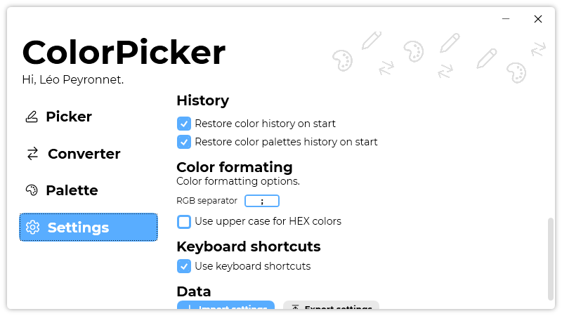

A new version of ColorPicker is now available, and it is the version 3.8.0.2112.

## Changelog
### New
- Added the possibility to add a generated color to history in "Picker" page (#84)
- Added a tooltip on the "Add to history" button (#84)
- Added the possibility to save the generated colors in "Picker" page's history (#85)
- Added the possibility to restore generated colors on startup (#85)
- Added the possibility to save the user's color palettes (#86)
- Added the possibility to restore the user's color palettes on startup (#86)
- Redesigned links in "Settings" page (#87)- Added translations (#88)
- Added the possibility to disable the automatic restore of generated colors on start (#88)
- Added the possibility to disable the automatic restore of the user's color palettes on start (#89)
### Fixed
- Fixed an issue with System theme not working on Windows 11
### Updated
- Updated LeoCorpLibrary

## Download

[Click here](https://tinyurl.com/DownloadColorPicker) to download ColorPicker.

> Note: If you update from an older version of ColorPicker, you may face an error. To resolve it, go to "%APPDATA%\Léo Corporation" in the file explorer, and delete the “ColorPicker” folder. Launch ColorPicker again, and the issue should be fixed.

## Screenshot
