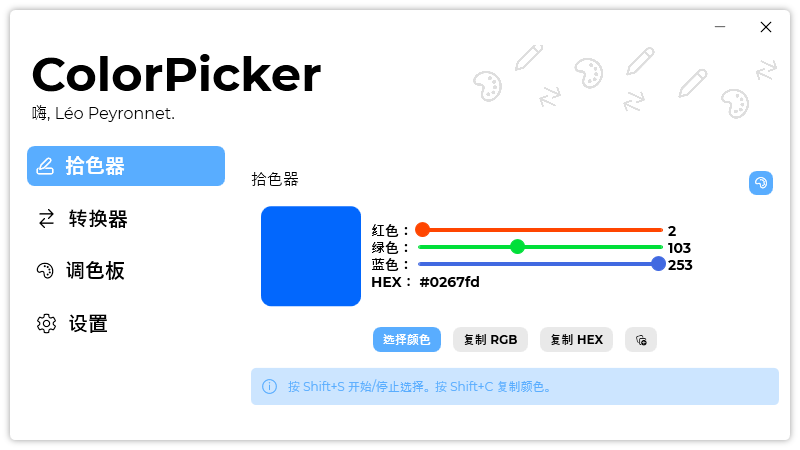

A new version of ColorPicker is available, despite a new one that came yesterday, version 3.8.1.2112 is here with fixes, and most importantly, Simplified Chinese!

## Changelog
### New
- Added Simplified Chinese (#94) (Thanks to @wcxu21)
### Fixed
- Fixed a crash issue when updating from an older version

## Download

[Click here](https://tinyurl.com/DownloadColorPicker) to download ColorPicker.

## Special Thanks

Thanks to [@wcxu21](https://github.com/wcxu21) for the translations!

## Screenshot

