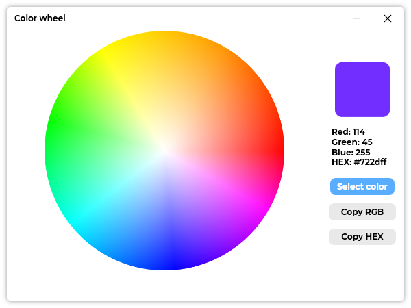

A new version of ColorPicker is now available, and it is the version 3.9.0.2201.

## Changelog
### New
- Added the possibility to pin the window (#99)
- Added translations (#100)
- Added an image for the color wheel (#100)
- Added the possibility to select a color from a Wheel (#100)
- Added a button to the "Color Wheel" window (#100)
- Added a "Cross" cursor on the color wheel (#100)
- Color informations are now hidden when launching the color wheel window (#100)
- Clicking on the color wheel stops selection (#100)
- Added title to color wheel window (#100)
- When the mouse leaves the color wheel, the selection stops (#100)
- Added the possibility to copy the selected color (#100)
- Added "Text tool" window (#101)
- Added button to "Text tool" window (#101)
- Improved the design of the ComboBox in "Text tool" (#101)
- Added sample text to "Text tool" window (#101)
- Added the possibility to choose a font in "Text tool" (#101)
- Added the possibility to set the font size in "Text tool" (#101)
- Added labels next to fields in "Text tool" window (#101)
- Improved design and added the possibility to scroll in "Text tool" wndow (#101)
- Added the possibility to set the foreground and the background color of the "Text tool" window (#101)
### Updated
- Updated LeoCorpLibrary
- Updated Licenses (#102)

## Download

[Click here](https://tinyurl.com/DownloadColorPicker) to download ColorPicker.

## Screenshot
