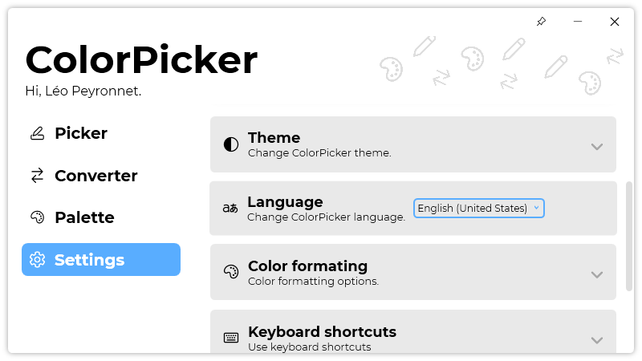
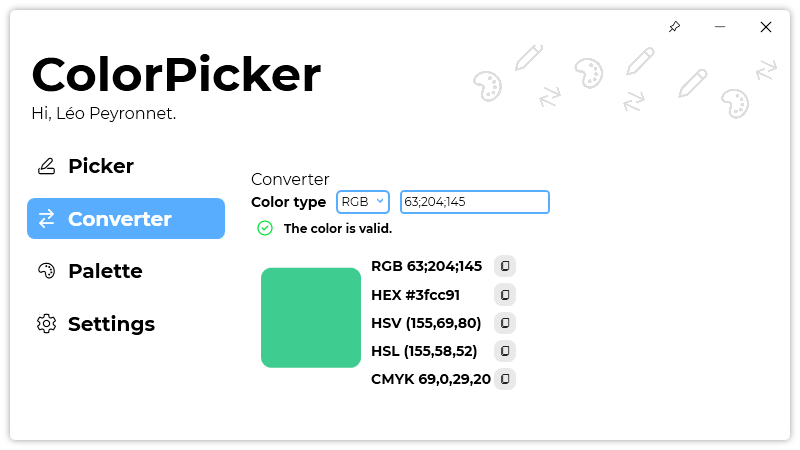
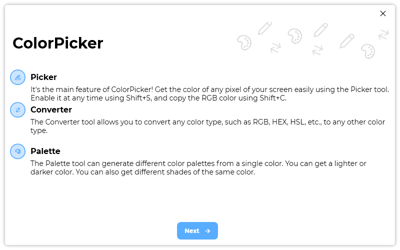

A new version of ColorPicker is now available, and it is the version 4.0.0.2202. This is a major version of ColorPicker which brings lots of new changes and features.

## Changelog
### New
- Checks for update on start are disabled by default (#110)
- Added translations (#113)
- Added "First run" window (#113)
- "First run" window now shows up on first run (#113)
- Added logo (#113)
- Added "Welcome" page (#113)
- Added "Tutorial" page (#113)
- Added "Theme" page (#113)
- Added "Language" page (#113)
- Added "Update" page (#113)
- Added the possibility to end the "First run" experience (#113)
- Added Expander style (#114)
- Added "Theme" category in Settings (#114)
- Added "Language" category in Settings (#114)
- Added "History" category in Settings (#114)
- Added "Color formatting" category in Settings (#114)
- Added "Keyboard shortcuts" category in Settings (#114)
- Added "Data" category in "Settings" (#114)
- Added "Licenses" category in Settings (#114)
- Added an animation when navigating ColorPicker (#115)
- Redesigned the "Converter" page (#116)
### Fixed
- Fixed: Wrong title for "Text tool" window (#112)
- Fixed an issue with light theme
### Updated
- Updated ColorHelper
- Updated LeoCorpLibrary
- Updated Setup
- Improved hover animations on the side bar (#115)

## Download

[Click here](https://tinyurl.com/DownloadColorPicker) to download ColorPicker.

## Screenshots

