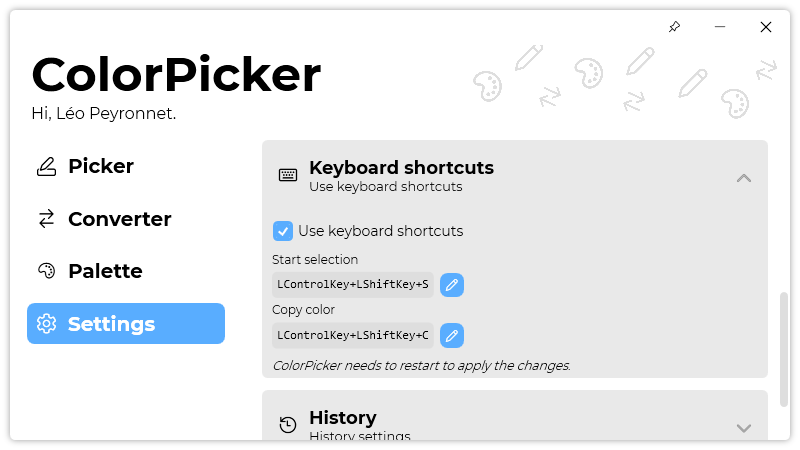

A new version of ColorPicker is now available, and it is the version 4.1.0.2204.

## Changelog
### New
- Added translations (#124)
- Added the possibility to set the favorite color "type" (#124)
- Added the possibility to copy a color* as any color type (#124)
- Added more info on "ColorItem" tooltip (#124)
- Added the possibility to copy a color (item) as any color type (#124)
- Added the possibility to copy colors in "Palette" history (#124)
- Converter page is now using default color type (#124)
- Added "Compact mode" button (#125)
- Added compact mode (#125)
- Added translations (#126)
- Added keyboard shortcuts section in Settings (#126)
- Added icon on "Edit" button (#126)
- Added fallback keyboard shortcut if none is specified (#126)
- Added the possibility to set default keyboard shortcuts (#126)
- Added a "restart" message in "Keyboard shortcuts" section (#126)
- Added a "Credits" window (#127)
### Fixed
- The "Copy" button now updates when browsing the app (#124)
- "Compact mode" button is only visible in "Picker" page (#125)
- Fixed icon issue
- Shortcut TextBoxes are now loading on start (#126)
- Fixed tooltip issue (#126)
### Updated
- Updated ColorHelper
- Updated LeoCorpLibrary
- Upgraded to a newer version of LeoCorpLibrary
- Updated Setup
- Upgraded to .NET 6
- The fallback keyboard shortcut is the default one (#126)
- Updated "Shortcut guide" on Picker page (#126)

## Download

[Click here](https://tinyurl.com/DownloadColorPicker) to download ColorPicker.

## Screenshot
