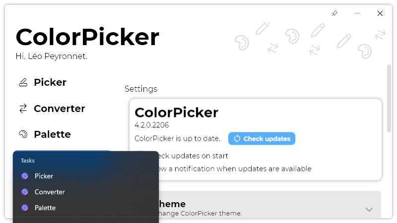

A new version of ColorPicker is now available, and it is the version 4.2.0.2206.

## Changelog
### New
- Added the possibility to remove specific color from history (#136)
- Added default values in "Text tool" (#137)
- Added the possibility to select a color from the color wheel (#138)
- Added "Hand" cursor on "Color border" (#138)
- Added a tooltip on the border (#138)
- Added translations (#139)
- Added taskbar Jump Lists (#139)
- Added "Pages" enum (#139)
- Added logic for jump lists (#139)
- Added the possibility to save the "pin" state of the window (#140)
- ColorPicker now remembers the "pin" state (#140)
### Fixed
- Fixed: ColorPicker crashes when selecting a font in "Text tool" (#135)
### Updated
- Updated LeoCorpLibrary

## Download

[Click here](http://tinyurl.com/DownloadColorPicker) to download ColorPicker

## Screenshot
