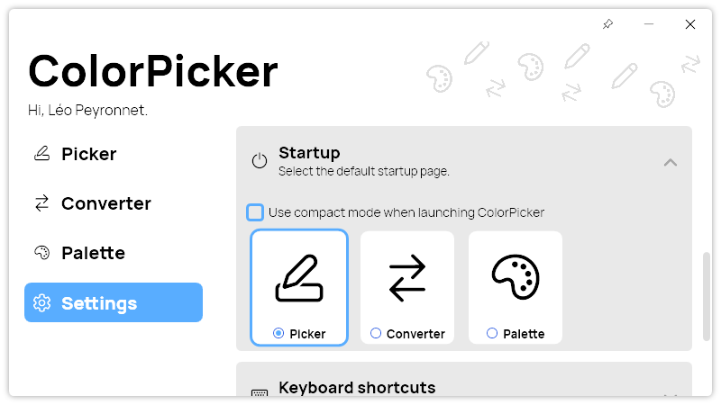

A new version of ColorPicker is now available, and it is the version 4.3.0.2207.

## Changelog
### New
- Added translations (#149)
- Added "Startup page" section in Settings (#149)
- Added UI logic for Startup section (#149)
- Added the possibility to set the default start page (#149)
- Added OpenSource mention (#150)
- Added "Use compact mode" checkbox in Settings (#151)
- Added the possibility to enable "Compact" mode by default (#151)
- Added font files (#152)

### Updated
- Updated LeoCorpLibrary
- Updated default font (#152)
- Removed old font files (#152)

## Download

[Click here](http://tinyurl.com/DownloadColorPicker) to download ColorPicker.

## Screenshot
