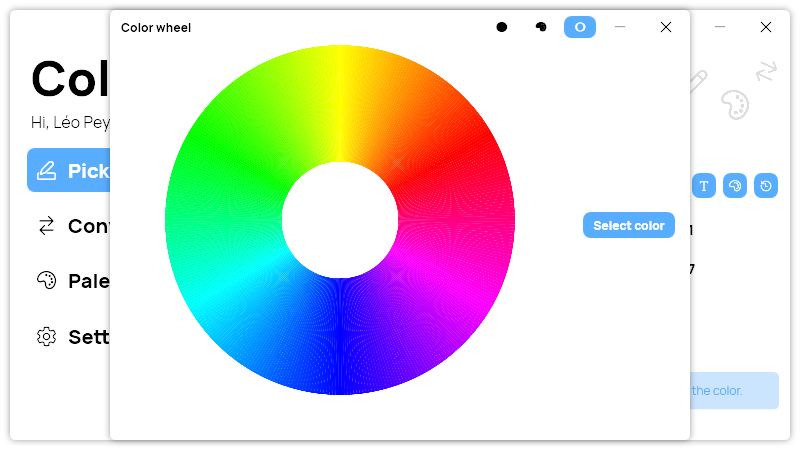

A new version of ColorPicker is now available, and it is the version 4.4.0.2208.

## Changelog
### New
- Replaced "LControlKey" with "Ctrl" in "Picker" page info message (#161)
- Added translations (#162)
- Added the possibility to reset "Select" keyboard shortcut to default value (#162)
- Added the possibility to reset "Copy" keyboard shortcut to default value (#162)
- Added Text tool properties in settings class (#163)
- Added default values for Text tool settings (#163)
- Added translations (#163)
- Added "Text tool" section in Settings page (#163)
- The "Text Tool" section now loads the user's settings (#163)
- Added the possibility to set the default font of the Text tool (#163)
- Added the possibility to set the default font size of the Text tool (#163)
- Added the possibility to set the default foreground color of the text tool (#163)
- Added the possibility to set the default background color of the text tool (#163)
- Added other chromatic wheel images (#164)
- Added new icons (#164)
- Added other chromatic wheels (#164)

### Updated
- Updated LeoCorpLibrary
- Updated ColorHelper

## Download

[Click here](https://tinyurl.com/DownloadColorPicker) to download ColorPicker

## Screenshot

