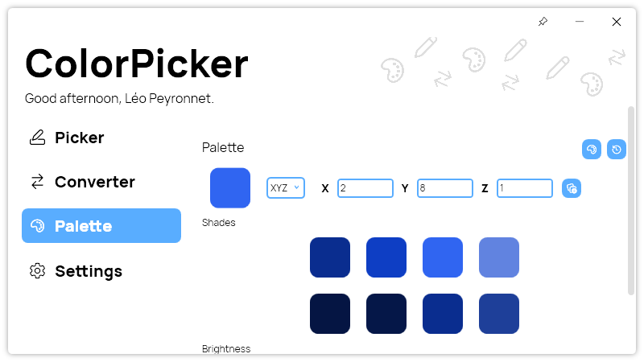

A new version of ColorPicker is now available, and it is the version 4.5.0.2210.

## Changelog
### New
- Added XYZ color type (#170)
- Added the possibility to copy XYZ color (#170)
- Added the possibility to convert a XYZ color (#170)
- Added YIQ color type (#171)
- Added the possibility to copy YIQ color (#171)
- Added the possibility to convert a YIQ color (#171)
- Added new colors to tooltip
- Added translations (#172)
- Added the possibility to generate a palette from any color type (#172)
- Added the possibility to calculate the contrast ratio in text tool (#173)

### Fixed
- Fixed a translation issue
- Made the app smoother when closing it (#174)

## Download

[Click here](https://tinyurl.com/DownloadColorPicker) to download ColorPicker

## Screenshot

