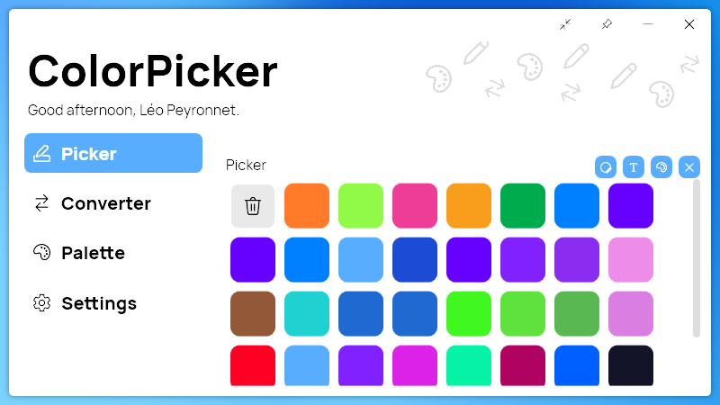

A new version of ColorPicker is now available, and it is the version 4.6.0.2212.

## Changelog
### New
- Added mouse coordinates in Mini Picker (#185)
- Added the possibility to generate a random color with any color types in Palette (#186)

### Fixed
- Fixed: Text contrast ratio is wrong (#183)
- Fixed: Scroll bar in "Color History" doesn't work (#184)

### Updated
- Replaced LeoCorpLibrary with PeyrSharp (#187) 

## Download

[Click here](https://tinyurl.com/DownloadColorPicker) to download ColorPicker

## Screenshot

