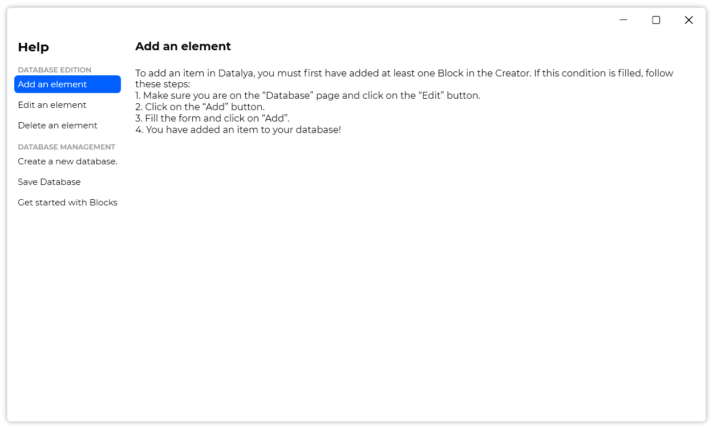

A new version of Datalya is now available, and it is the version 1.1.0.2108.

## Changelog
### New
- Added translations
- Added animations on "Ribbon" buttons (#3)
- Added animations on "Tab" buttons (#3)
- Added animations on "Help" buttons (#3)
- Added "Help" window (#4)
- Added "Add an item" help page (#4)
- Added "Edit an item" help page (#4)
- Added "Delete an item" help page (#4)
- Added "Create database" help page (#4)
- Added "Save database" help page (#4)
- Added "Get started with Blocks" help page (#4)
### Fixed
- Fixed issues with the "Save" message (#5)
- Fixed: The "Close Database" button doesn't work if the database has Blocks, but has no items (#6)
### Updated
- Updated LeoCorpLibrary
- Updated Setup
- Made the "Save" message appear only if the database was modified (#5)
- Updated "See licenses" message

## Download

[Click here](https://tinyurl.com/DownloadDatalya) to download Datalya.

## Website

Did you know that Datalya has a website? [Click here](https://datalya.leocorporation.dev/) to check it out.

## Screenshot

