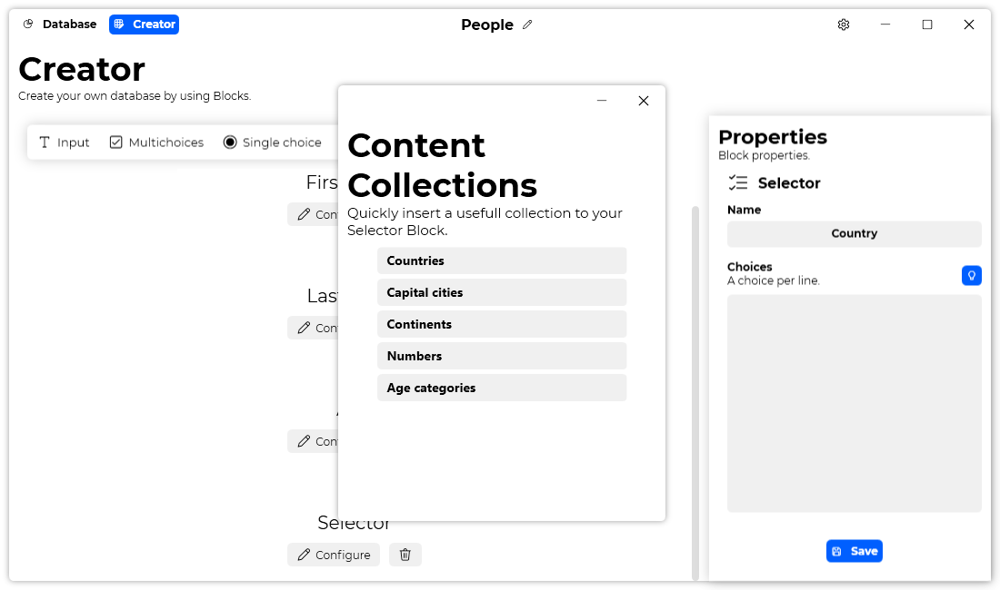

A new version of Datalya is now available, and it is the version 1.2.0.2109.

## Changelog
### New
- Added translations for Content Collections (#17)
- Added Content Collections template (#17)
- Added "Content Collections Item" (#17)
- Added "Content Collections" window (#17)
### Fixed
- Fixed: Help title is wrong (#15)
- Fixed: "Edition" should be "Editing" (#19)
### Updated
- Updated LeoCorpLibrary
- Improved the "Creator" page "Detail" panel responsiveness (#18)
- Improved the padding of the "Language" drop down (#16)

## Download

[Click here](https://tinyurl.com/DownloadDatalya) to download Datalya.

## Website

Did you know that Datalya has a website? [Click here](https://datalya.leocorporation.dev/) to check it out.

## Screenshot

