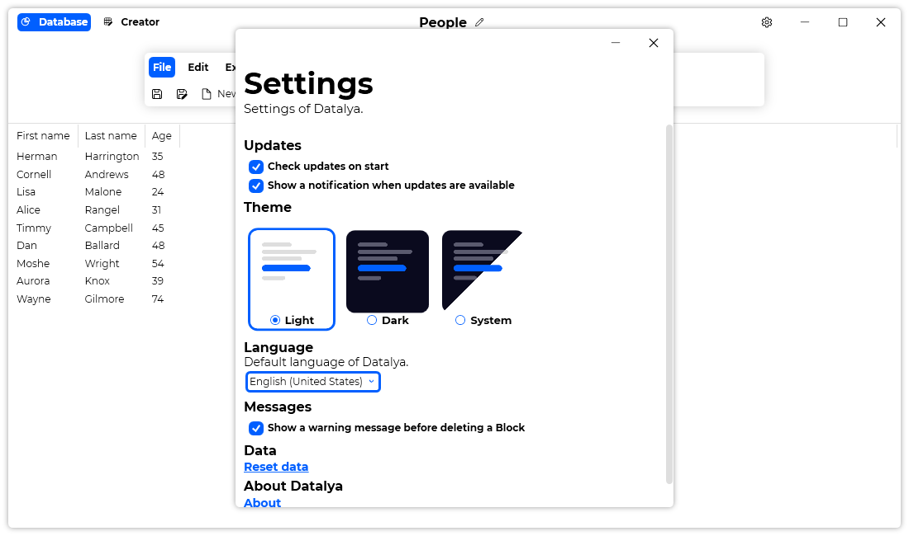

A new version of Datalya is now available, and it is the version 1.3.0.2111.

## Changelog
### New
- Added the possibility to import a "Template" when there is already Blocks (#30)
- Added translations
- Added a confirm message before deleting a Block (#31)
- Added the possibility to disable the confirm message when deleting a Block (#32)
- Added new resources
- Added "About" section in "Settings" window (#33)
- Fixed: "Info" window can be maximized (#27)
- Fixed: "Add" window can be maximized (#28)
- Fixed: "Edit" window can be maximized (#28)
- Fixed: When adding an empty "Selector" Block, the app crashes (#29)
- Fixed translation issues

## Download

[Click here](https://tinyurl.com/DownloadDatalya) to download Datalya.

## Screenshot
