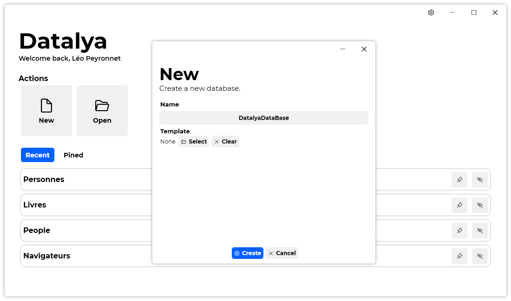

A new version of Datalya is now available, and it is the version 1.4.0.2201.

## Changelog
### New
- Added translations (#44)
- Added a "Preview" section when a Template is selected in "New" window (#44)
- Redesigned links in "Settings" (#45)
- Added a taskbar jump list with links to specific tasks (#46)
### Fixed
- Fixed: MainWindow doesn't have a minimum size (#41)
- Fixed an issue with dark theme no longer working on Windows 11
### Updated
- Updated LeoCorpLibrary
- Updated Licenses copyright years (#42)
- Updated splash screen (#43)

## Download

[Click here](https://tinyurl.com/DownloadDatalya) to download Datalya.

## Screenshot
