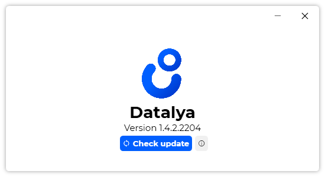

A small update of Datalya is now available, and it is included in version 1.4.2.2204.

## Changelog
### New
- Added a warning message when a database was edited in a newer version (#57)
### Updated
- Updated LeoCorpLibrary
- Upgraded LeoCorpLibrary

## Website

[Click here](https://datalya.leocorporation.dev/) to go to the website of Datalya.

## Download

[Click here](https://tinyurl.com/DownloadDatalya) to download Datalya

## Image

