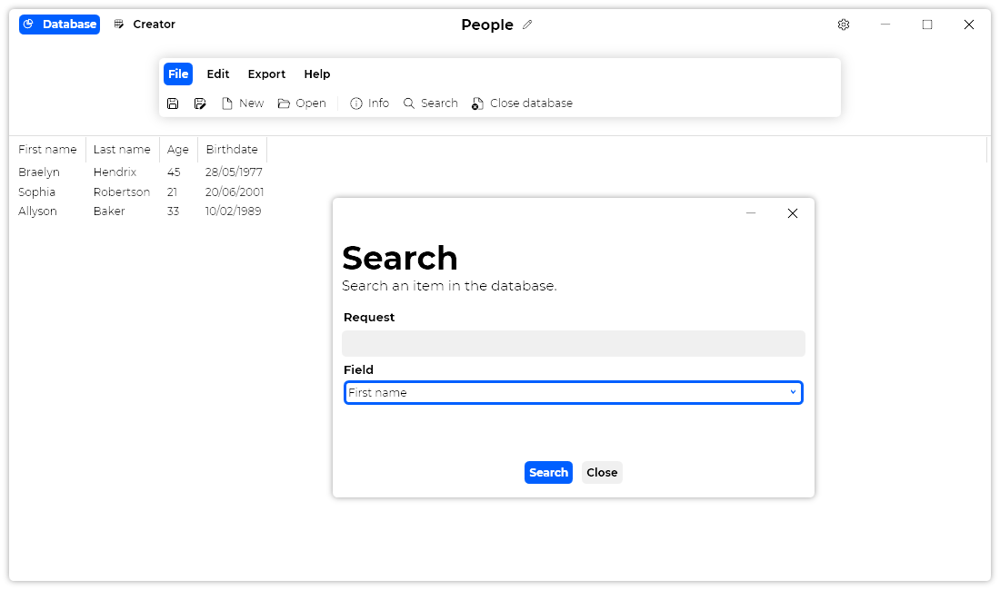

A new version of Datalya is now available, and it is the version 1.5.0.2206.

## Changelog
### New
- Added translations (#63)
- Added "DateBlock" class (#63)
- Added "DateBlock" creator UI (#63)
- Added "DateBlock" properties UI (#63)
- Added "Date" block (#63)
- Added full "Date" creator UI (#63)
- Added styles to "Date" block (#63)
- Added the possibility to set the default tab (#65)
- Added translations (#66)
- Added "Search" window (#66)
- Added a search feature (#66)
- Added a message when no results are found (#66)
- Added a message when no request is provided (#66)
- Added a message in case of an error in "Search" window (#66)
- Added a default field in "Search" window (#66)
### Fixed
- Fixed an issue with file version
- Fixed an issue with default date (#63)
- Fixed an issue when a default date is used (#63)
- Fixed: The app crashes when clicking the "Info" button with an empty database (#64)
### Updated
- Updated LeoCorpLibrary
- Updated "Help" with new Date block (#67)

## Download

[Click here](http://tinyurl.com/DownloadDatalya) to download Datalya.

## Website

[Click here](https://datalya.leocorporation.dev/) to see the website of Datalya.

## Screenshot
