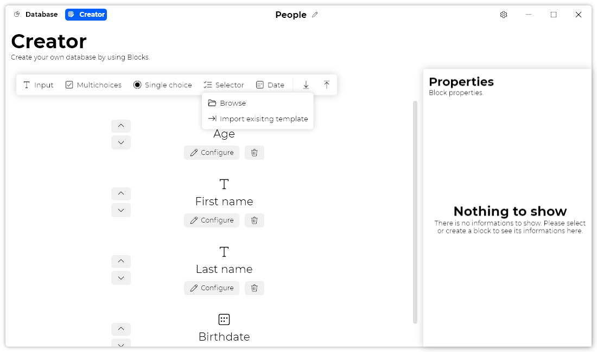

A new version of Datalya is now available, and it is the version 1.6.0.2208.

## Changelog

### New

- Added "Re-order" buttons in Input Block (#75)
- Added "Re-order" buttons in Multichoices Block (#75)
- Added "Re-order" buttons in Selector Block (#75)
- Added "Re-order" buttons in Single Choice Block (#75)
- Added "Re-order" button in Date Block (#75)
- Added the possibility to move up a Block (#75)
- Added the possibility to move down a Block (#75)
- Added the possibility to re-order Blocks (#75)
- Added translations (#76)
- Added a "Popup" menu on the "Import" button (#76)
- Added the possibility to import existing template (#76)
- Redesigned the "Select a template" window (#77)

### Fixed

- Fixed an issue where deleting a Block is impossible
- Fixed popup behavior (#76)

### Updated

- Updated ClosedXML
- Updated LeoCorpLibrary

## Download

[Click here](https://tinyurl.com/DownloadDatalya) to download Datalya

## Website

[Click here](https://datalya.leocorporation.dev/) to go to Datalya’s website.

## Screenshot
