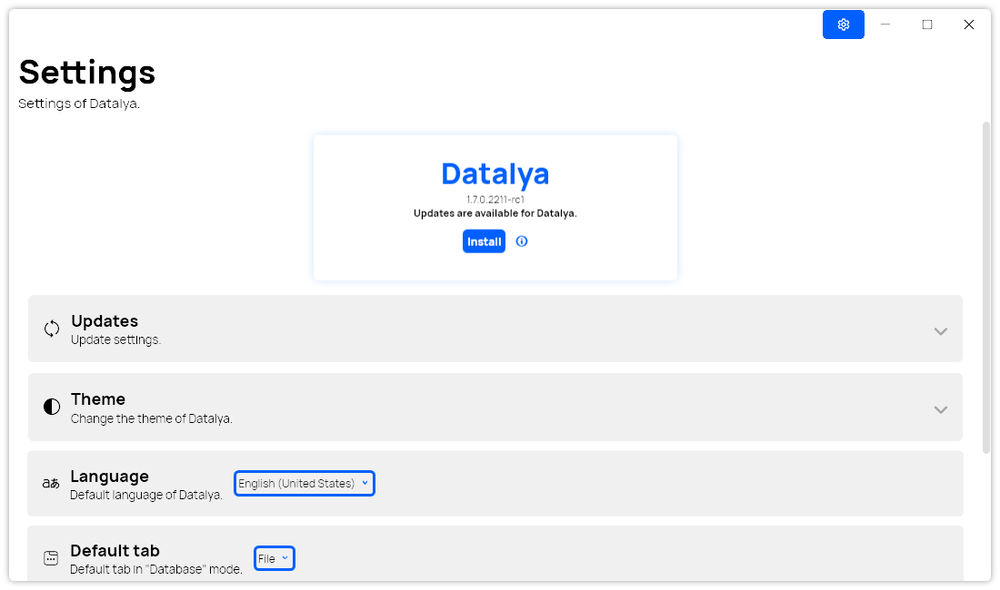

A new version of Datalya is now available, and it is the version 1.7.0.2211.

## Changelog
### New
- Converted the Settings window to a page (#85)
- Added translations (#85)
- Added new app styles (#85)
- Added "Updates" settings section (#85)
- Added "Theme" settings section (#85)
- Added "Language" settings section (#85)
- Added "Default tab" settings section (#85)
- Added "Messages" settings section (#85)
- Added "Data" settings section (#85)
- Added "About" section in Settings (#85)
- Added the possibility to search in a selector block (#86)
- Added the possibility to search recent files (#87)
- Replaced LeoCorpLIbrary with PeyrSharp (#89)

### Fixed
- Fixed an alignment inconsistency in Date Block
- Fixed an issue with notifications
- Fixed: Wrong font in "Content Collections" window (#88)
- Fixed wrong icon in Settings

### Updated
- Updated ClosedXML
- Removed legacy windows (#85)

## The new settings page
The new settings page is the new place where you can customize Datalya. It is easy-to-use and more intuitive than the old settings window. It is also the new place where you can check for updates. You can access it in the Home window and when editing a database.

## Download

[Click here](https://tinyurl.com/DownloadDatalya) to download Datalya

## Website

[Click here](https://datalya.leocorporation.dev/) to go to Datalya’s website.

## Screenshot
