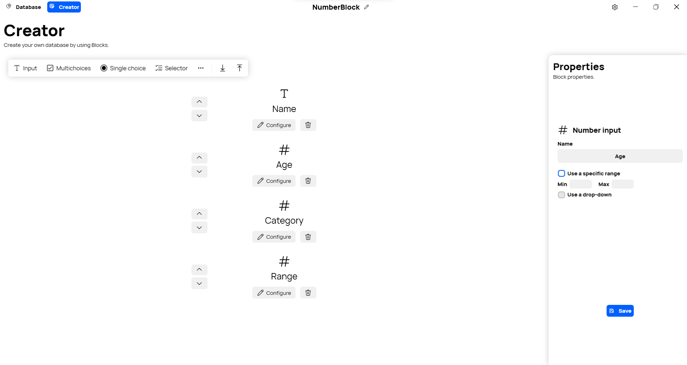

A new version of Datalya is now available, and it brings the new Number Input Block.

## Number Block

The new Number Input Block is similar to the Text Input Block, except it only allows relative integer numbers to be entered. The Block also has the ability to only accept numbers from a specific range, and you can customize the appearance of the Block: You can choose between a regular text field or a drop-down menu (if you selected a custom range).

## Changelog
### New
- The size of the window is now saved (#107)
- Added a drop-down menu in Creator (#108)
- Added translations (#110)
- Added Number Block representation (#110)
- Added Number Creator UI (#110)
- Added Number Properties UI (#110)
- Added Number Block UI (#110)
- Added Number Block (#110)

### Fixed
- Fixed an issue when window is maximized (#106)

### Updated
- Updated PeyrSharp (#104)
- Updated ClosedXML (#105)
- Improved the details panel design (#109)
- Updated Help (#110)
- Improved margins
- Updated Licenses

## Download

[Click here](https://tinyurl.com/DownloadDatalya) to download Datalya

## Website

[Click here](https://datalya.leocorporation.dev/) to go to Datalya’s website.