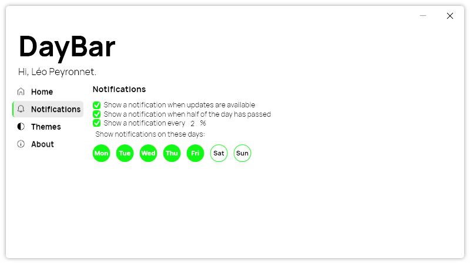

A new version of DayBar is now available, and it is the version 1.1.0.2308.

## Changelog

### New

- Added the possibility to set work hours during the night (#3)
- Added the possibility to set minutes for work hours (#4)
- Added translations (#5)
- Added new notifications (#5)
- Added the possibility to set new notifications options (#5)
- Added new styles (#6)
- Added the possibility to receive notifications on specific days (#6)
- Added the possibility to select notifications days (#6)

### Fixed

- Fixed an issue with working hours
- Fixed an issue with new notifications
- Fixed an issue with work minutes
- Fixed an issue where multiple notifications showed up (#5)

## Notification settings

You can now have multiple notifications throughout your day to remind your progress. You can also select the days you want to receive these notifications.

## Download

[Click here](https://tinyurl.com/DayBar) to download DayBar.
