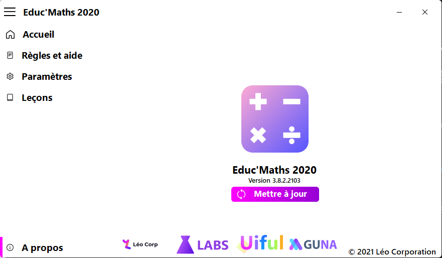

A new version is available for Educ’Maths 2020, and it is the version 3.8.2.2103.

## Changelog
### Fixed
- Fixed issues
### Updated
- Updated Léo Corporation logo
- Updated copyright
- Updated the “About” page

## Download

[Click here](http://bit.ly/39zlQTG) to download Educ’Maths 2020.

## Screenshot

