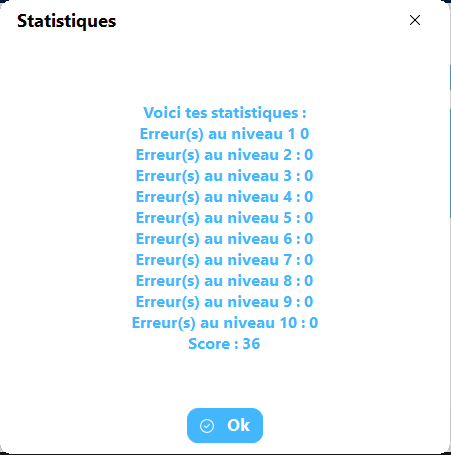

A new version of Educ’Maths 2021 is available, and it is the version 4.2.0.2104. Note that Educ’Maths 2021 is only available in French.

## Changelog
### New
- Added the “Statistics” window
- Added the “Credits” window
### Updated
- Updated assets (logos…)
- Updated copyright

## Download

[Click here](https://www.mediafire.com/file/wu2cc4cxgwfytl0/Educ'Maths+2021+Setup.msi/file) to download Educ’Maths 2021.

## Screenshot

