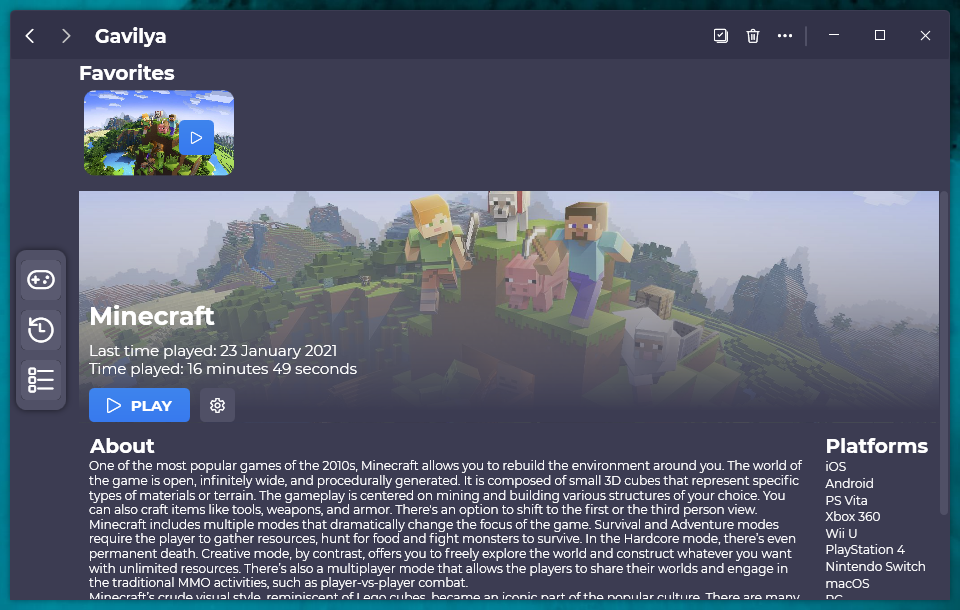

A new version of Gavilya is now available, and it's the version 1.1.0.2101.

## Changelog
### New
- Added navigation buttons (#40)
- Added an indicator when the navigation buttons are enabled or not (#40)
- Redesigned the "Favorites" cards (#41)
- Added the possibility to choose the startup page (#42)
- Added the possibility to sort games by alphabetical order (#43)
- Added a confirm message before deleting an item (#47)
### Fixed
- Fixed an issue with the navigation system (#40)
- Fixed an issue with the "Add" button
### Updated
- Updated LeoCorpLibrary
- Updated Setup
- Updated the font

## Download
[Click here](https://www.mediafire.com/file/o17u9ejfc3po061/GavilyaSetup.exe/file) to download Gavilya.

## Screenshot
